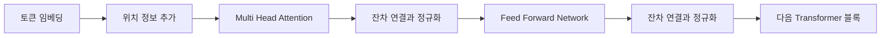

# Transformer 아키텍처

- **Self-Attention**으로 문장 내 모든 토큰의 관계를 병렬 계산한다.
- **Q, K, V**를 사용해 각 토큰이 참고할 다른 토큰의 중요도를 구한다.
- Attention, FFN, 잔차 연결, 정규화를 반복해 표현을 점진적으로 개선한다.

## 개념 설명

Transformer는 순환 신경망처럼 토큰을 순서대로 처리하지 않고, 입력 시퀀스 전체를 한 번에 처리한다. 핵심은 **Scaled Dot-Product Attention**이다. 입력 임베딩에서 Query, Key, Value를 만들고, `QKᵀ`로 토큰 간 유사도를 계산한다. 이 값을 `√d_k`로 나누는 이유는 차원이 커질 때 내적 값이 지나치게 커져 Softmax가 특정 위치에만 집중하는 현상을 줄이기 위해서다.

Attention 가중치는 다음과 같이 계산한다.

`Attention(Q, K, V) = softmax(QKᵀ / √d_k)V`

각 토큰이 모든 토큰을 참고하므로 장거리 의존성 학습에 강하다. 여러 개의 Attention Head를 병렬로 사용하면 문법적 관계, 의미적 관계처럼 서로 다른 패턴을 동시에 학습할 수 있다. 이후 각 위치에 독립적으로 적용되는 **Feed-Forward Network**가 비선형 변환을 수행한다.

Transformer 블록은 일반적으로 `Multi-Head Attention → Add & Norm → FFN → Add & Norm` 순서로 구성된다. 잔차 연결은 깊은 네트워크에서 정보와 그래디언트가 잘 전달되게 하며, Layer Normalization은 학습을 안정화한다. 순서 정보가 Attention만으로는 표현되지 않으므로 위치 임베딩 또는 RoPE 같은 positional encoding을 추가한다.

Encoder는 전체 입력을 양방향으로 보고 표현을 만들며 BERT가 대표적이다. Decoder는 미래 토큰을 보지 못하도록 **causal mask**를 사용하고, GPT처럼 다음 토큰을 예측한다. 최근 LLM은 주로 decoder-only 구조를 사용한다.

## 코드 예제

```python
import torch
from torch import nn

batch, length, dim, heads = 2, 5, 16, 4
x = torch.randn(batch, length, dim)
attention = nn.MultiheadAttention(dim, heads, batch_first=True)
mask = torch.triu(torch.ones(length, length), diagonal=1).bool()
context, weights = attention(x, x, x, attn_mask=mask)
ffn = nn.Sequential(nn.Linear(dim, 4 * dim), nn.GELU(), nn.Linear(4 * dim, dim))
y = nn.LayerNorm(dim)(x + context)
y = nn.LayerNorm(dim)(y + ffn(y))
print(y.shape, weights.shape)  # [2, 5, 16], [2, 5, 5]
```



## 면접 질문

### 1. Self-Attention의 시간·공간 복잡도는?

시퀀스 길이를 `n`, 임베딩 차원을 `d`라고 하면 Attention 행렬 계산은 보통 **시간·메모리 모두 O(n²)**이다. 긴 문장에서 병목이 되므로 FlashAttention, Sparse Attention, 선형 Attention 등이 사용된다.

### 2. Transformer에서 positional encoding이 필요한 이유는?

Self-Attention은 입력 토큰의 순서를 본질적으로 알지 못한다. 따라서 절대 위치 임베딩, 상대 위치 임베딩, RoPE 등을 추가해 “앞뒤 관계”와 거리 정보를 제공한다.

## 한 줄 정리

Transformer는 QKV 기반 Attention과 잔차·정규화·FFN을 반복해 토큰 간 장거리 관계를 병렬 학습하는 아키텍처다.
