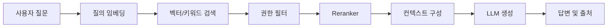

# RAG(Retrieval-Augmented Generation) 실무 트러블슈팅

## 핵심 요약

- **RAG는 검색 결과를 프롬프트에 주입해 LLM의 최신성·도메인 정확도를 보완**하는 구조다.
- 품질은 모델보다 **문서 전처리, 청킹, 임베딩, 검색, 재순위화, 프롬프트**의 영향을 크게 받는다.
- 장애 분석은 “모델이 틀렸다”가 아니라 **검색 결과가 틀렸는지, 컨텍스트가 잘렸는지, 생성이 왜곡됐는지**를 분리해서 확인해야 한다.

## 개념 설명

RAG는 사용자의 질문을 임베딩으로 변환한 뒤 벡터 DB에서 관련 문서 청크를 검색하고, 검색 결과를 LLM 입력에 포함해 답변을 생성하는 패턴이다. 일반적인 흐름은 `질문 → 검색 → 컨텍스트 구성 → 생성`이다. 키워드 검색과 벡터 검색을 함께 사용하는 하이브리드 검색, 검색 결과를 다시 정렬하는 reranker를 추가하면 정확도가 개선될 수 있다.

실무에서 가장 흔한 문제는 **검색 실패**다. 문서가 너무 크게 청킹되면 관련 정보와 불필요한 정보가 섞이고, 너무 작으면 문맥이 끊긴다. 제목, 문서 경로, 권한, 버전 같은 메타데이터를 함께 저장하면 필터링과 출처 표시가 쉬워진다. 표·코드·PDF 레이아웃이 깨진 경우에는 임베딩 이전의 파싱 품질부터 확인해야 한다.

검색은 되지만 답변이 틀리면 top-k, 유사도 임계값, reranker, 중복 청크를 점검한다. 컨텍스트가 지나치게 길면 중요한 청크가 묻히거나 LLM 입력 한도를 초과할 수 있다. 프롬프트에는 “근거가 없으면 모른다고 답하라”, 출처를 표시하라 같은 제약을 명시한다. 그래도 환각이 발생할 수 있으므로 답변과 함께 문서 ID·페이지를 반환하고 검증 가능한 로그를 남긴다.

운영 시에는 질문, 검색 청크, 점수, 최종 프롬프트, 답변, 지연 시간, 토큰 수를 추적한다. 평가도 단순 정답률보다 검색 적중률(Recall), 근거성, 답변 유용성, 지연 시간, 비용을 분리해 측정한다. 문서 권한을 검색 단계에서 적용하지 않으면 사용자가 접근할 수 없는 정보가 노출될 수 있으므로 ACL 필터를 반드시 서버 측에서 강제한다.

## 코드 예시

```python
def answer(query, user_id):
    q = embed(query)
    docs = store.search(
        q, k=8, filter={"allowed_users": user_id}
    )
    docs = rerank(query, docs)[:4]
    context = "\n\n".join(
        f"[{d.id}] {d.text}" for d in docs
    )
    prompt = f"근거만 사용하고 없으면 모른다고 답해라.\n{context}\n질문: {query}"
    return llm.generate(prompt), [d.id for d in docs]
```

## 처리 흐름



## 인터뷰 질문

### 1. RAG에서 답변 품질이 낮을 때 무엇부터 확인하나요?

검색된 청크와 점수를 먼저 확인한다. 관련 문서가 없으면 파싱·청킹·임베딩·검색 설정 문제이고, 관련 문서가 있는데 틀리면 컨텍스트 길이·프롬프트·모델 생성 문제로 분리한다.

### 2. 벡터 검색만 사용하지 않고 하이브리드 검색을 쓰는 이유는 무엇인가요?

벡터 검색은 의미 유사성에 강하지만 고유명사·에러 코드·정확한 버전 문자열에 약하다. 키워드 검색을 결합하면 의미 검색과 정확한 문자열 매칭을 함께 확보할 수 있다.

## 한 줄 정리

**RAG의 핵심은 LLM 선택보다 신뢰할 수 있는 검색·근거 추적·권한 통제·관측 가능성을 설계하는 것이다.**
