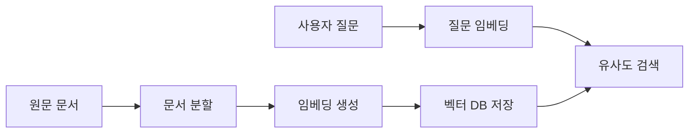

# 벡터 데이터베이스와 임베딩

## 핵심 요약

- **임베딩**은 텍스트·이미지 같은 데이터를 의미를 보존하는 고차원 숫자 벡터로 변환한다.
- **벡터 데이터베이스**는 벡터 간 유사도를 빠르게 계산하고, 관련 문서와 메타데이터를 함께 검색한다.
- RAG에서는 `문서 분할 → 임베딩 생성 → 저장 → 질문 임베딩 → 유사 문서 검색` 순서로 활용한다.

## 개념 설명

임베딩 모델은 문장을 `[-0.12, 0.84, ...]` 형태의 고정 길이 벡터로 바꾼다. 의미가 비슷한 문장은 벡터 공간에서도 가까운 위치에 배치된다. 예를 들어 “환불 정책”과 “결제 취소 방법”은 단어가 완전히 같지 않아도 유사한 벡터를 가질 수 있다.

검색 시에는 질문을 같은 임베딩 모델로 변환한 뒤, 저장된 벡터와 **코사인 유사도**, 내적, 유클리드 거리 등을 비교한다. 코사인 유사도는 벡터 방향의 유사성을 측정하므로 텍스트 검색에서 자주 사용된다. 실제 서비스는 모든 벡터를 선형 탐색하지 않고 HNSW, IVF 같은 ANN(Approximate Nearest Neighbor) 인덱스를 사용해 속도를 높인다.

벡터 DB에는 벡터만 저장하지 않는다. 원문, 문서 ID, 작성자, 날짜, 권한 같은 메타데이터도 함께 저장한다. 따라서 “최근 문서 중 backend 팀 자료만 검색”처럼 벡터 유사도와 조건 필터를 결합할 수 있다. 문서를 너무 크게 넣으면 검색 결과가 뭉뚱그려지고, 너무 작게 나누면 문맥이 사라지므로 적절한 chunk 크기와 overlap이 중요하다.

운영 환경에서는 임베딩 모델을 변경할 때 벡터 차원과 분포가 달라질 수 있으므로 기존 인덱스를 재생성해야 한다. 또한 검색 결과의 정확도는 Recall@k, MRR, 정답 문서 포함 여부 등으로 평가하고, 개인정보와 접근 권한 필터를 검색 단계에서 반드시 적용해야 한다.

## 코드 예제

```python
import chromadb
from sentence_transformers import SentenceTransformer

model = SentenceTransformer("all-MiniLM-L6-v2")
db = chromadb.PersistentClient(path="./vector_store")
col = db.get_or_create_collection("docs")

docs = ["Redis는 캐시와 세션 저장에 사용한다.",
        "PostgreSQL은 관계형 데이터베이스다.",
        "HNSW는 근사 최근접 이웃 검색 인덱스다."]
vecs = model.encode(docs, normalize_embeddings=True).tolist()
col.add(ids=["1", "2", "3"], documents=docs, embeddings=vecs,
        metadatas=[{"team": "backend"}] * 3)

question = "빠른 임시 데이터 저장 기술은?"
qvec = model.encode([question], normalize_embeddings=True).tolist()
result = col.query(query_embeddings=qvec, n_results=2,
                   where={"team": "backend"})
print(result["documents"][0])
```

## 검색 흐름



## 면접 질문

### 1. 일반 키워드 검색과 벡터 검색의 차이는?

키워드 검색은 정확한 단어와 빈도에 강하고, 벡터 검색은 표현이 달라도 의미가 비슷한 문서를 찾는 데 강하다. 실무에서는 BM25와 벡터 검색을 결합한 하이브리드 검색을 자주 사용한다.

### 2. 임베딩 모델을 바꾸면 왜 전체 재색인이 필요한가?

새 모델은 벡터 차원이나 벡터 공간의 의미가 달라진다. 기존 벡터와 새 질문 벡터를 직접 비교하면 유사도 기준이 일관되지 않으므로 문서를 다시 임베딩하고 인덱스를 재생성해야 한다.

## 한 줄 정리

**임베딩은 의미를 벡터로 표현하고, 벡터 DB는 그 의미를 빠르게 검색하는 저장소다.**
