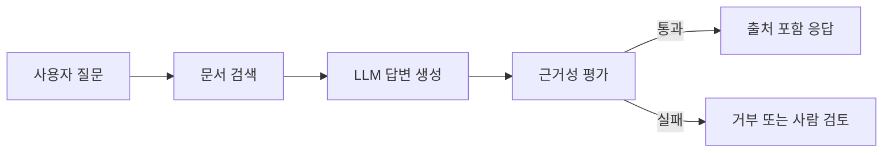

# 모델 평가와 환각(Hallucination)

- **모델 평가는 정확도 하나가 아니라** 사실성, 관련성, 일관성, 안전성, 비용, 지연시간을 함께 측정해야 한다.
- **환각은 그럴듯하지만 근거가 없거나 틀린 답변**이며, 검색·생성 결합(RAG), 출처 표시, 답변 거부 정책으로 줄인다.
- **현업에서는 오프라인 평가와 운영 중 모니터링을 연결**해 배포 전 품질과 배포 후 회귀(regression)를 모두 관리한다.

## 개념 설명

일반 분류 모델은 정확도, 정밀도, 재현율, F1처럼 정답 라벨과 예측을 비교한다. 그러나 LLM은 같은 의미를 여러 표현으로 답하므로 단순 문자열 비교가 어렵다. 따라서 평가 목적에 따라 지표를 나눈다.

- **정확성(Factuality)**: 답변이 문서나 데이터베이스의 사실과 일치하는가
- **근거성(Groundedness)**: 제공된 검색 문맥에서 답변이 추론 가능한가
- **관련성(Relevance)**: 질문에 직접 답하고 불필요한 내용을 줄였는가
- **완전성(Completeness)**: 요구된 항목을 빠뜨리지 않았는가
- **운영 지표**: p95 지연시간, 토큰 비용, 실패율, 사용자 재질문율

환각은 크게 두 가지다. 검색 문서와 모순되는 **사실 오류**와, 문서에 없는 내용을 만들어내는 **근거 없는 생성**이다. 예를 들어 사내 규정 챗봇이 존재하지 않는 휴가 정책을 안내하면 법무·인사 리스크로 이어진다. 고객지원에서는 답변에 문서 ID와 원문 링크를 함께 노출하고, 검색 결과의 유사도가 낮으면 “확인할 수 없다”고 답하게 하는 것이 효과적이다.

실무 평가셋은 실제 문의, 과거 장애 사례, 악의적 질문, 최신 정책을 포함해 구성한다. 배포 전에는 기준 모델과 새 모델의 동일 질문 결과를 비교하고, 배포 후에는 샘플링한 대화를 사람이 검수하거나 LLM-as-a-Judge로 1차 분류한다. 단, 평가 모델도 편향과 오류가 있으므로 핵심 업무에서는 사람의 표본 검증이 필요하다.

```python
def grounded(answer, contexts):
    cited = answer.get("citations", [])
    source = "\n".join(contexts)
    return bool(cited) and all(c in source for c in cited)

if not grounded(result, retrieved_docs):
    result = {"text": "근거를 확인할 수 없어 답변을 보류합니다."}
```



## 면접 질문

### 1. LLM 평가에서 정확도만 사용하면 안 되는 이유는?

생성 답변은 표현이 다양하고, 정답이어도 문자열이 다를 수 있다. 따라서 사실성·근거성·관련성·안전성과 운영 지표를 함께 평가해야 한다.

### 2. RAG를 적용하면 환각이 완전히 사라지는가?

아니다. 검색 실패, 오래된 문서, 잘못된 문맥, 모델의 과잉 추론이 남는다. 검색 품질 평가, 출처 검증, 낮은 신뢰도에서의 답변 거부가 필요하다.

**한 줄 정리:** 모델 품질은 “잘 대답하는가”가 아니라 “근거를 바탕으로 안전하고 일관되게 운영되는가”로 평가해야 한다.
