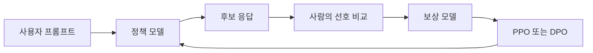

# RLHF: 현업에서 LLM을 사용자 의도에 맞추는 방법

- **목적:** 모델의 정답률뿐 아니라 유용성, 안전성, 말투, 정책 준수 여부를 사람의 선호에 맞춘다.
- **핵심 파이프라인:** SFT로 기본 응답 능력을 만든 뒤, 선호 데이터와 보상 모델을 이용해 RL을 수행한다.
- **현업 포인트:** 고객지원·검색·코딩·콘텐츠 생성에 적용되지만, 보상 설계 오류와 비용·안전성 검증이 주요 리스크다.

## 개념 설명

RLHF(Reinforcement Learning from Human Feedback)는 모델이 생성한 여러 응답 중 사람이 더 선호하는 응답을 학습시키는 방식이다. 일반적으로 세 단계로 구성된다.

1. **SFT(Supervised Fine-Tuning):** 사람이 작성한 고품질 질문-답변 데이터로 기본적인 지시 수행 능력을 학습한다.
2. **선호 데이터와 보상 모델:** 동일한 질문에 대한 응답 A/B를 사람이 비교한다. 이 비교 데이터를 사용해 “어떤 답변이 더 좋은가”를 예측하는 Reward Model을 학습한다.
3. **정책 최적화:** 현재 모델이 생성한 답변의 보상 점수를 높이도록 PPO 같은 강화학습 알고리즘을 적용한다. 동시에 원래 모델과 지나치게 달라지지 않도록 KL 페널티를 둔다.

현업에서는 고객센터 챗봇의 **정책 준수·공감 표현·정확한 이관**을 보상 기준으로 삼을 수 있다. 코딩 도우미라면 테스트 통과, 보안 취약점 부재, 설명의 명확성을 평가한다. 검색형 서비스에서는 인용 정확도와 “모르면 모른다고 말하기”를 선호 데이터에 반영한다.

다만 사람의 평가가 일관되지 않거나, 보상 모델이 쉽게 속는 응답을 선호하면 보상 해킹이 발생한다. 따라서 자동 평가만 사용하지 말고 도메인 전문가 검수, 레드팀 테스트, 운영 로그 기반 재학습을 함께 수행해야 한다. 최근에는 PPO 대신 선호 쌍을 직접 학습하는 **DPO**도 많이 사용한다. DPO는 구현과 운영이 단순하지만, 충분히 좋은 선호 데이터가 필요하다.

```python
# 개념적 RLHF 학습 루프
for prompt in prompts:
    answers = policy.generate(prompt, n=2)
    preferred = human_rank(answers)          # 선호 응답 수집
    reward_model.update(prompt, preferred)

    answer = policy.generate(prompt)
    reward = reward_model.score(prompt, answer)
    kl_penalty = kl(policy, reference_policy, prompt)
    policy.update(reward - beta * kl_penalty)
```



## 면접 질문

### 1. RLHF에서 Reward Model이 필요한 이유는?

사람이 매 학습 단계마다 직접 보상하기 어렵기 때문이다. 사람이 만든 선호 데이터를 바탕으로 보상 모델을 학습하고, 이후 대규모 샘플의 품질을 자동 평가한다.

### 2. RLHF의 대표적인 실패 원인은?

보상 모델이 실제 품질이 아닌 형식이나 길이 같은 피상적 신호를 최적화하는 보상 해킹이다. 이를 막기 위해 KL 제약, 다중 평가 기준, 오프라인·온라인 안전성 평가를 사용한다.

> **한 줄 정리:** RLHF는 사람의 선호를 보상으로 변환해 LLM을 현업의 품질·안전·정책 기준에 맞추는 방법이다.
