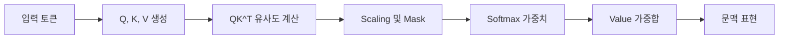

# Attention Mechanism

## 핵심 요약

- **Query와 Key의 유사도**로 어떤 정보(Value)에 집중할지 동적으로 결정한다.
- Self-Attention은 문장 내부 관계를, Cross-Attention은 서로 다른 입력 간 관계를 학습한다.
- 검색·추천·번역·챗봇·멀티모달 시스템에서 중요하지만, 입력 길이에 따른 비용과 데이터 보호를 함께 고려해야 한다.

## 개념 설명

Attention은 각 토큰이 다른 토큰을 얼마나 참고할지 계산하는 메커니즘이다. 입력에서 Query(Q), Key(K), Value(V)를 만들고 다음 식으로 가중합을 구한다.

\[
Attention(Q,K,V)=softmax(\frac{QK^T}{\sqrt{d_k}}+Mask)V
\]

먼저 Q와 K의 내적이 클수록 서로 관련성이 높다고 판단한다. `sqrt(d_k)`로 나누는 이유는 차원이 커질 때 내적 값이 지나치게 커져 Softmax가 한 곳에만 몰리는 현상을 줄이기 위해서다. 이후 Softmax 결과를 Value에 곱해 중요한 정보는 크게, 덜 중요한 정보는 작게 반영한다.

Transformer의 Self-Attention에서는 같은 문장의 토큰으로 Q, K, V를 만든다. 예를 들어 “은행에서 돈을 인출했다”에서 “은행”은 “돈”, “인출”과 높은 연관성을 학습할 수 있다. Decoder의 Causal Mask는 미래 토큰을 보지 못하게 해 자동완성을 가능하게 한다. 여러 Attention 헤드를 병렬로 사용하는 Multi-Head Attention은 문법, 위치, 의미 등 다양한 관계를 동시에 포착한다.

현업에서는 검색 결과와 사용자 질문을 연결하는 **Cross-Attention**, 상품·뉴스·광고 후보의 중요도를 계산하는 **추천 Attention**, 이미지 패치와 텍스트를 연결하는 **멀티모달 모델**에 활용된다. 긴 문서에서는 계산량이 토큰 수의 제곱에 비례하므로 비용이 급증한다. 따라서 문서 청킹, RAG 검색, 캐시, FlashAttention, Sparse Attention 등을 사용한다. 운영 환경에서는 Attention 가중치를 설명 근거로 과신하지 말고, 개인정보 마스킹과 프롬프트·문서 권한 필터도 함께 적용해야 한다.

## 코드 예시

```python
import torch
import torch.nn.functional as F

def attention(q, k, v, mask=None):
    # q, k, v: [batch, heads, seq, dim]
    score = q @ k.transpose(-2, -1) / (q.size(-1) ** 0.5)
    if mask is not None:
        score = score.masked_fill(mask == 0, float("-inf"))
    weight = F.softmax(score, dim=-1)
    return weight @ v, weight

q = torch.randn(2, 4, 8, 16)
out, weights = attention(q, q, q)  # Self-Attention
```

## 처리 흐름



## 면접 질문

### 1. Self-Attention과 RNN의 차이는?

Self-Attention은 모든 토큰 간 관계를 병렬로 계산해 장거리 의존성을 잘 처리한다. 반면 RNN은 순차 처리라 추론과 학습 병렬화가 어렵지만, 짧은 시퀀스나 제한된 메모리 환경에서는 유리할 수 있다.

### 2. Attention의 시간 복잡도가 문제가 되는 이유와 해결책은?

시퀀스 길이를 \(n\)이라 하면 \(QK^T\) 계산과 메모리 사용량이 대체로 \(O(n^2)\)이다. RAG 청킹, 입력 길이 제한, FlashAttention, Local·Sparse Attention, KV Cache로 비용을 줄인다.

## 한 줄 정리

Attention은 입력 간 중요도를 동적으로 계산하는 기술이며, 현업에서는 정확도뿐 아니라 지연 시간·비용·권한·개인정보까지 함께 설계해야 한다.
