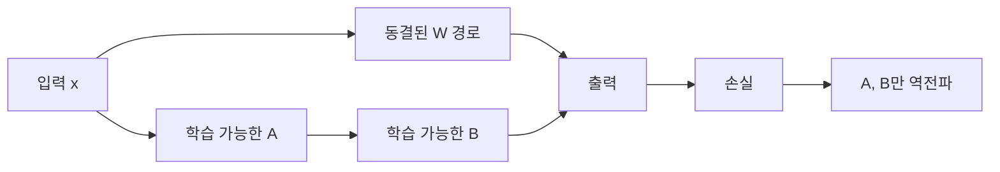

# Fine-tuning과 LoRA 내부 구현

- **Full Fine-tuning**은 사전학습 모델의 모든 파라미터를 업데이트하므로 표현력은 높지만 GPU 메모리와 저장 공간을 많이 사용한다.
- **LoRA**는 기존 가중치를 고정하고 저랭크 행렬만 학습해 업데이트 파라미터와 옵티마이저 상태를 크게 줄인다.
- 실무에서는 LoRA 어댑터를 분리 저장하고, 추론 시 원본 모델에 병합하거나 별도 경로로 적용한다.

## 개념 설명

Fine-tuning은 사전학습된 가중치 \(W\)를 작업 데이터의 손실 함수에 대해 역전파하는 과정이다.

\[
W' = W - \eta \frac{\partial L}{\partial W}
\]

Full Fine-tuning에서는 모든 레이어의 \(W\), gradient, Adam의 1차·2차 모멘텀을 저장해야 한다. 따라서 파라미터 메모리뿐 아니라 학습 상태 메모리도 커진다. 예를 들어 파라미터를 FP16으로 저장해도 Adam 상태를 FP32로 유지하면 파라미터 하나당 여러 복사본이 필요하다.

LoRA는 원본 가중치 \(W\)를 동결하고, 다음과 같은 저랭크 변화량만 학습한다.

\[
W' = W + \Delta W,\qquad \Delta W = \frac{\alpha}{r}BA
\]

여기서 \(A \in \mathbb{R}^{r \times d_{in}}\), \(B \in \mathbb{R}^{d_{out} \times r}\), \(r\)은 원래 차원보다 작은 rank다. 초기에는 \(B\)를 0으로 설정해 \(\Delta W=0\)이 되도록 하므로, 학습 시작 시 원본 모델의 동작을 보존한다. 보통 Transformer의 `q_proj`, `v_proj` 같은 선형층에 삽입한다.

순전파는 다음처럼 구현된다.

\[
y = Wx + \frac{\alpha}{r}B(Ax)
\]

원본 경로의 행렬곱은 그대로 수행하지만, 학습 가능한 경로는 작은 rank를 거치므로 gradient와 optimizer state가 크게 감소한다. 다만 LoRA는 모든 연산을 제거하지 않는다. 추론 시 어댑터를 별도 적용하면 두 경로를 계산하고, `W ← W + αBA/r`로 병합하면 일반 선형층 하나로 실행할 수 있다. 여러 작업의 어댑터를 교체하는 경우에는 병합하지 않는 방식이 유리하다.

QLoRA는 원본 \(W\)를 4비트로 양자화하고 LoRA 파라미터와 계산용 활성화는 더 높은 정밀도로 유지한다. 이때 양자화된 가중치는 업데이트하지 않으며, 메모리 절약과 품질 사이의 균형이 핵심이다.

```python
class LoRALinear(nn.Module):
    def __init__(self, base, rank=8, alpha=16):
        super().__init__()
        self.base = base
        self.base.weight.requires_grad_(False)
        self.A = nn.Parameter(torch.randn(rank, base.in_features) * 0.01)
        self.B = nn.Parameter(torch.zeros(base.out_features, rank))
        self.scale = alpha / rank

    def forward(self, x):
        y = self.base(x)
        update = (x @ self.A.T) @ self.B.T
        return y + self.scale * update
```



## 면접 질문

### 1. LoRA가 메모리를 줄이는 이유는?

원본 모델의 gradient와 optimizer state를 저장하지 않고, rank가 작은 \(A, B\)와 그 상태만 학습하기 때문이다. 단, 활성화 메모리와 원본 모델 가중치 메모리는 여전히 필요하다.

### 2. LoRA를 추론 전에 병합할 수 있는 이유는?

선형 연산의 가중치 변화량이 \(\Delta W=\alpha BA/r\)로 계산 가능하기 때문이다. 이를 원본 \(W\)에 더하면 별도 LoRA 경로 없이 \(W'\) 하나로 동일한 선형 변환을 수행할 수 있다.

## 한 줄 정리

**LoRA는 원본 가중치를 고정하고 저랭크 업데이트만 학습해, 품질을 유지하면서 Fine-tuning 비용을 줄이는 기법이다.**
