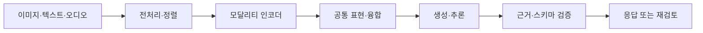

# 멀티모달 모델: 자주 하는 실수와 안티패턴

## 핵심 요약

- 텍스트·이미지·오디오·비디오를 함께 처리하지만, **모달리티 간 의미 정렬(alignment)** 이 자동으로 완벽해지는 것은 아니다.
- 입력 전처리, 해상도, 순서, 타임스탬프가 결과에 큰 영향을 주므로 **모델 호출보다 데이터 품질 검증이 먼저**다.
- “이미지를 봤으니 사실을 안다”라고 가정하면 안 된다. OCR 오류, 환각, 편향, 프롬프트 인젝션을 별도로 방어해야 한다.

## 개념 설명

멀티모달 모델은 서로 다른 형태의 입력을 공통 표현 공간에 매핑한 뒤, 모달리티 간 관계를 학습한다. 예를 들어 이미지 인코더가 시각 특징을 추출하고, 텍스트 인코더 또는 디코더가 질문과 결합해 답변을 생성한다. 모델에 따라 초기에 특징을 결합하는 early fusion, 중간 표현에서 결합하는 intermediate fusion, 결과 단계에서 결합하는 late fusion을 사용한다.

가장 흔한 실수는 **입력 정렬을 생략하는 것**이다. 동영상 프레임과 음성의 시간축이 어긋나거나, 여러 이미지의 순서가 불명확하면 모델은 그럴듯하지만 틀린 관계를 추론한다. 이미지 크기를 무조건 낮추는 것도 위험하다. 작은 글자, 표, 영수증은 전체 장면보다 고해상도 또는 영역 분할이 중요하다.

또 다른 안티패턴은 텍스트 전용 프롬프트를 그대로 이미지에 적용하는 것이다. “분석해줘” 대신 대상, 위치, 근거, 불확실성을 명시해야 한다. “이미지에서 읽은 텍스트와 추론한 내용을 구분하고, 확신이 낮으면 모른다고 답하라”처럼 출력 계약을 둔다. OCR 결과는 원본 이미지와 대조하고, 숫자·단위·날짜는 후처리 검증한다.

이미지 안의 문구를 시스템 지시처럼 신뢰해서도 안 된다. 포스터나 웹페이지에 “이전 지시를 무시하라”는 문장이 있을 수 있으므로, 외부 콘텐츠는 **데이터**이지 권한 있는 지시가 아니다. 개인정보가 포함된 이미지의 저장·로깅·학습 사용 여부도 점검한다. 평가는 평균 정확도 하나로 끝내지 말고 OCR, 공간 관계, 차트 해석, 안전성, 모달리티별 실패율을 분리해 측정한다.

## 코드 예시

```python
def build_request(image, question):
    image = resize_preserving_ratio(image, max_side=1600)
    return {
        "image": image,
        "prompt": (
            "관찰한 사실과 추론을 분리하라. "
            "숫자·단위는 원본과 대조하고, 불확실하면 표시하라.\n"
            f"질문: {question}"
        ),
    }

result = model.generate(build_request(image, question))
assert validate_schema(result)          # 근거, 답변, 불확실성
assert verify_sensitive_fields(result)  # 날짜·금액·개인정보
```

## 처리 흐름



## 면접 질문

### 1. 멀티모달 모델에서 alignment가 중요한 이유는?

각 모달리티의 정보가 같은 객체·시점·위치를 가리키도록 연결해야 올바른 추론이 가능하기 때문이다. 정렬이 깨지면 모델은 상관없는 정보를 결합해 환각을 만든다.

### 2. 이미지 속 텍스트를 모델이 읽었다면 그대로 신뢰해도 되는가?

아니다. OCR 오류와 이미지 기반 프롬프트 인젝션이 가능하다. 원본 대조, 구조화 출력, 숫자 검증, 신뢰 경계 설정이 필요하다.

## 한 줄 정리

멀티모달 시스템의 품질은 모델 크기보다 **모달리티 정렬, 근거 검증, 실패 모드별 평가**에 좌우된다.
