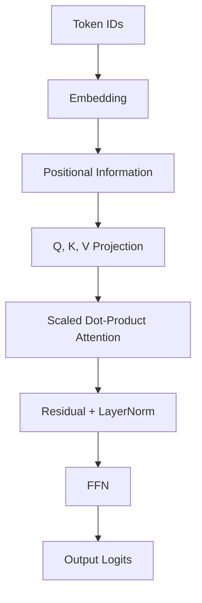

# Transformer 아키텍처: 내부 구현 관점

- **Self-Attention**은 토큰 간 의존성을 행렬 연산으로 계산하며, 핵심은 `QKᵀ`와 `softmax`이다.
- **Multi-Head Attention**은 여러 표현 공간에서 관계를 병렬 학습한 뒤 연결하고 선형 변환한다.
- 각 블록은 **Residual + LayerNorm + FFN**으로 구성되며, 위치 정보는 Positional Encoding 또는 RoPE로 보완한다.

## 개념 설명

입력 토큰을 임베딩 행렬 `X ∈ R^(T×d_model)`로 바꾼 뒤, 선형층을 통과시켜 Query, Key, Value를 만든다.

```text
Q = XW_Q, K = XW_K, V = XW_V
Attention(Q,K,V) = softmax(QKᵀ / √d_k + mask)V
```

`QKᵀ`의 결과는 각 토큰이 다른 모든 토큰을 얼마나 참고할지 나타내는 점수 행렬이다. `√d_k`로 나누는 이유는 차원이 커질수록 내적 값의 분산이 커져 softmax가 지나치게 뾰족해지는 현상을 줄이기 위해서다. 패딩 토큰은 `-∞`에 가까운 값으로 마스킹하여 attention 확률이 0이 되게 한다.

Multi-Head Attention에서는 `d_model`을 여러 head로 나눈다. 예를 들어 `d_model=512`, `heads=8`이면 각 head 차원은 64이다. 각 head가 독립적으로 attention을 계산하고 결과를 이어 붙인 뒤 `W_O`로 다시 투영한다. 구현에서는 보통 `[batch, seq, dim]`을 `[batch, heads, seq, head_dim]`으로 reshape 및 transpose한다.

Attention 뒤에는 position-wise FFN이 적용된다.

```text
FFN(x) = GELU(xW₁ + b₁)W₂ + b₂
```

각 서브레이어에는 잔차 연결과 LayerNorm이 들어간다. Pre-LN 구조는 `x + Attention(LN(x))`처럼 정규화 후 연산하므로 깊은 모델에서 학습이 안정적이다. Decoder-only 모델은 미래 토큰을 보지 못하도록 causal mask를 사용하고, 학습 시 입력을 한 칸 이동한 정답과 비교하는 next-token prediction을 수행한다. 계산량은 시퀀스 길이 `T`에 대해 attention 행렬 때문에 일반적으로 `O(T²d)`이며, 긴 문맥에서 메모리 병목이 된다. 실제 시스템에서는 KV cache로 이미 계산한 Key와 Value를 재사용해 추론 비용을 줄인다.

## 구현 예시

```python
import torch
import torch.nn.functional as F

def self_attention(x, Wq, Wk, Wv, causal=False):
    B, T, D = x.shape
    q, k, v = x @ Wq, x @ Wk, x @ Wv
    score = q @ k.transpose(-2, -1) / (D ** 0.5)
    if causal:
        mask = torch.triu(torch.ones(T, T, device=x.device), 1).bool()
        score = score.masked_fill(mask, float("-inf"))
    weight = F.softmax(score, dim=-1)
    return weight @ v
```

## 처리 흐름



## 면접 질문

### 1. Self-Attention의 시간·공간 복잡도는 왜 시퀀스 길이에 대해 제곱인가?

`QKᵀ`가 `T×T` 관계 행렬을 만들기 때문이다. 따라서 일반적으로 시간과 attention 행렬 메모리가 `O(T²)`로 증가한다.

### 2. KV Cache는 Transformer 추론을 어떻게 최적화하는가?

자동회귀 생성에서 과거 토큰의 Key와 Value를 저장한다. 새 토큰의 Query만 기존 KV와 계산하므로 매 단계마다 과거 토큰을 다시 투영하는 비용을 제거한다.

## 한 줄 요약

Transformer는 QKV 기반 전역 attention과 잔차·정규화·FFN 블록을 반복해 토큰 간 관계를 병렬 학습하는 아키텍처다.
