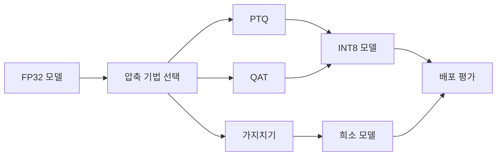

# 양자화와 모델 압축: 면접 대비 핵심 정리

- **양자화(Quantization)**: FP32 가중치·활성값을 INT8, FP16, INT4 등 낮은 비트로 표현해 메모리와 연산 비용을 줄인다.
- **대표 압축 기법**: 양자화, 가지치기(Pruning), 지식 증류(Distillation), 저랭크 분해가 있으며 목적과 손실 특성이 다르다.
- **핵심 트레이드오프**: 모델 크기와 지연 시간은 줄지만 정확도, 지원 연산자, 하드웨어 효율이 영향을 받으므로 배포 환경 기준으로 선택해야 한다.

## 개념 설명

모델 압축은 정확도 저하를 최소화하면서 파라미터 수, 메모리 사용량, 추론 지연 시간을 줄이는 방법이다. 양자화는 실수값을 제한된 정수 구간으로 매핑한다. 일반적으로 다음과 같이 표현한다.

`q = round(x / scale) + zero_point`

여기서 `scale`은 실수 범위를 정수 범위로 변환하는 비율이고, `zero_point`는 0을 표현하기 위한 오프셋이다. 복원 시에는 `x ≈ scale × (q - zero_point)`를 사용한다. 대칭 양자화는 `zero_point=0`으로 계산이 단순하고, 비대칭 양자화는 값의 분포가 한쪽으로 치우친 경우 표현 범위가 효율적이다.

**PTQ(Post-Training Quantization)**는 학습 완료 모델을 바로 양자화하므로 적용이 쉽고 비용이 낮다. 다만 활성값 통계를 얻기 위한 보정 데이터가 필요하며 정확도 손실이 발생할 수 있다. **QAT(Quantization-Aware Training)**는 학습 중 양자화 오차를 모사하므로 더 높은 정확도를 기대할 수 있지만 재학습 비용이 든다. FP16은 정확도 손실이 작고 GPU 지원이 좋으며, INT8은 메모리와 정수 연산 효율이 뛰어나다. INT4는 LLM 메모리 절감에 유리하지만 품질과 커널 지원을 더 주의해야 한다.

가지치기는 중요도가 낮은 연결을 제거하고, 지식 증류는 큰 교사 모델의 출력 분포를 작은 학생 모델이 학습하게 한다. 따라서 “압축률”만 비교하지 말고 실제 하드웨어에서의 latency, throughput, 전력, 정확도를 함께 측정해야 한다.

```python
import torch
from torch import nn

model = nn.Sequential(nn.Linear(768, 3072), nn.ReLU(),
                      nn.Linear(3072, 10)).eval()
qmodel = torch.ao.quantization.quantize_dynamic(
    model, {nn.Linear}, dtype=torch.qint8
)
x = torch.randn(1, 768)
with torch.inference_mode():
    y = qmodel(x)
```



## 면접 질문 1

**Q. PTQ와 QAT의 차이와 각각 언제 사용하나요?**  
**A.** PTQ는 학습 후 적용해 비용이 낮지만 정확도 손실 가능성이 크다. QAT는 학습 중 양자화 오차를 반영해 정확도가 더 좋지만 재학습 비용이 크다. 정확도 민감 모델은 QAT, 빠른 배포와 충분한 여유가 있는 모델은 PTQ를 우선 검토한다.

## 면접 질문 2

**Q. INT8로 바꾸면 모델 크기와 추론 시간이 항상 4배 줄어드나요?**  
**A.** 아니다. 이론상 FP32 대비 가중치 메모리는 약 1/4이지만, 스케일·메타데이터와 비양자화 연산이 존재한다. 지연 시간도 CPU, GPU, NPU의 INT8 커널 지원과 메모리 병목에 따라 달라지므로 실제 벤치마크가 필요하다.

> **한 줄 정리:** 양자화는 가장 실용적인 압축 기법이지만, 정확도·하드웨어 지원·실측 지연 시간을 함께 최적화해야 한다.
