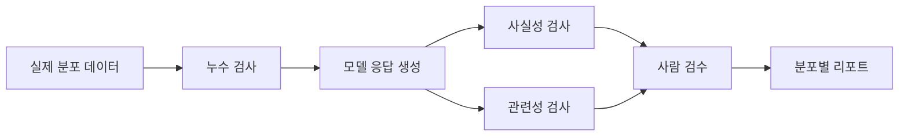

# 모델 평가와 환각

- **정답률 하나로 평가하지 말고** 사실성, 관련성, 완전성, 안전성, 불확실성 표현을 분리해 측정한다.
- **환각은 그럴듯한 오답**이다. 모델의 유창함이나 자신감은 근거의 존재를 보장하지 않는다.
- **평가 데이터와 방법 자체가 오염될 수 있다.** 데이터 누수, 기준 답안 편향, 체리피킹, 평가자 편향을 경계한다.

## 개념 설명

모델 평가는 입력에 대한 출력의 품질을 기준과 비교하는 과정이다. 분류 문제에서는 정확도·정밀도·재현율·F1을 사용할 수 있지만, 생성형 모델은 정답이 하나가 아니므로 단일 점수만으로 판단하기 어렵다. 답변을 **사실성(factuality)**, 질문과의 **관련성**, 요구사항 충족 여부, 표현의 안전성으로 나누어 평가하고, 실제 사용자 분포를 반영한 테스트셋을 별도로 유지해야 한다.

환각은 크게 두 종류다. 외부 사실과 불일치하는 **사실 환각**과, 주어진 문서에 없는 내용을 문서에서 도출한 것처럼 말하는 **근거 환각**이다. RAG를 사용해도 검색 문서가 틀렸거나, 모델이 문서와 무관한 내용을 섞으면 환각은 남는다.

자주 하는 실수는 학습 데이터와 테스트 데이터를 중복시키는 것, 공개 벤치마크 점수만 믿는 것, 어려운 샘플을 제외하고 평균을 내는 것, LLM 평가자 한 명의 점수를 정답처럼 사용하는 것이다. 또한 문자열 일치만으로 생성 답변을 채점하면 표현이 다른 정답을 오답 처리한다. 반대로 의미가 비슷하다는 이유만으로 수치·날짜·고유명사의 오류를 놓칠 수 있다.

안티패턴은 “모르면 답하지 않기”를 프롬프트 한 줄로만 해결하는 것이다. 더 나은 방식은 출처 요구, 검색 결과와의 근거성 검사, 확신도 또는 답변 거부율 측정, 사람 검수 샘플링을 함께 적용하는 것이다. 운영에서는 평균 점수보다 **환각률, 치명적 오류율, 거부의 정확성, 데이터 분포별 성능**을 추적한다.

## 코드 예시

```python
def evaluate(answer, evidence, required_facts):
    unsupported = [
        fact for fact in required_facts
        if fact not in evidence or fact not in answer
    ]
    grounded = len(unsupported) == 0
    return {
        "grounded": grounded,
        "unsupported_facts": unsupported,
        "needs_review": not grounded
    }

# 문자열 완전 일치 점수만 사용하지 않고,
# 핵심 사실의 근거 존재 여부를 별도로 확인한다.
result = evaluate(
    answer="서울은 대한민국의 수도이며 인구는 약 950만 명이다.",
    evidence="서울은 대한민국의 수도이다.",
    required_facts=["서울은 대한민국의 수도이다", "인구는 약 950만 명이다"]
)
```

## 평가 흐름



## 인터뷰 질문

### 1. 정확도가 높은데도 환각이 많을 수 있는 이유는?

정확도는 제한된 라벨과 데이터 분포에서의 평균값일 뿐이다. 희귀 질문, 최신 정보, 긴 문맥, 개방형 생성에서는 근거 없는 답변이 별도로 발생할 수 있다. 따라서 사실성·근거성·불확실성 표현을 분리 평가해야 한다.

### 2. LLM을 평가자로 사용할 때 주의할 점은?

평가자 모델의 편향, 프롬프트 민감도, 자기 선호, 길이 편향이 있다. 고정된 루브릭과 블라인드 비교를 사용하고, 사람 평가 및 규칙 기반 검사를 섞어 일치도와 오류 사례를 검증해야 한다.

> **한 줄 요약:** 좋은 평가는 평균 점수가 아니라, 다양한 사용자 조건에서 근거 없는 답변과 치명적 오류를 얼마나 줄였는지 보여준다.
