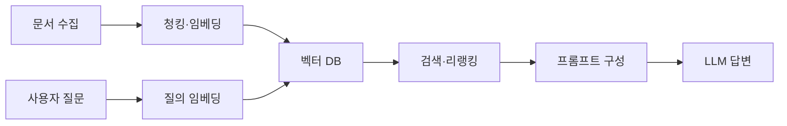

# RAG (Retrieval-Augmented Generation) 면접 정리

- **핵심 목적:** LLM이 외부 지식을 검색해 답변에 활용하도록 하여 최신성·정확성·도메인 특화 성능을 높인다.
- **핵심 파이프라인:** 문서 전처리·청킹 → 임베딩 및 벡터 저장 → 질의 검색 → 관련 문맥을 프롬프트에 삽입 → 생성 및 검증.
- **핵심 한계:** 검색 결과가 부정확하면 생성 답변도 틀리며, 청크 크기·검색 개수·프롬프트 설계에 따라 품질과 비용이 크게 달라진다.

## 개념 설명

RAG는 LLM의 파라미터에 모든 지식을 저장하지 않고, 질문 시 외부 문서에서 관련 정보를 검색해 답변에 사용하는 구조다. 일반적인 학습 데이터는 최신 문서나 사내 데이터를 즉시 반영하기 어렵지만, RAG는 문서 저장소만 갱신하면 된다. 따라서 파인튜닝보다 지식 변경에 유연하고, 검색된 근거를 함께 제시하기 쉽다.

문서는 너무 크게 넣으면 검색 정밀도가 떨어지고, 너무 작게 나누면 문맥이 끊긴다. 보통 일정한 크기로 청킹하고 일부를 겹치게 구성한다. 각 청크를 임베딩 모델로 벡터화한 뒤 벡터 DB에 저장하며, 질문도 같은 공간의 벡터로 변환해 유사도 검색한다. 검색 방식은 의미 기반의 벡터 검색, 키워드 기반 BM25, 두 방식을 결합한 하이브리드 검색이 있다.

실무에서는 검색 결과를 그대로 사용하지 않고 메타데이터 필터, 중복 제거, 리랭킹을 적용한다. 이후 검색 문맥과 질문을 LLM에 전달하고, “근거가 없으면 모른다고 답하라”는 제약을 둔다. 평가는 검색 단계의 Recall@K·MRR과 생성 단계의 정확성·근거성·응답 지연·비용을 분리해 측정해야 한다. RAG는 환각을 줄이지만 자동으로 제거하지는 않으며, 검색 실패와 오래된 문서도 별도로 관리해야 한다.

## 코드 예시

```python
question = "환불 정책은 어떻게 되나요?"
q_vec = embed(question)
hits = vector_db.search(q_vec, top_k=4)

context = "\n".join(hit.text for hit in hits)
prompt = f"""근거만 사용해 답하세요.
근거:
{context}
질문: {question}
근거가 없으면 모른다고 답하세요."""
answer = llm.generate(prompt)
```

## RAG 아키텍처



## 면접 질문

### 1. RAG와 파인튜닝의 차이는 무엇인가요?

RAG는 실행 시 외부 문서를 검색해 지식을 주입하므로 최신 정보와 사내 데이터 반영에 유리하다. 파인튜닝은 모델의 가중치를 변경해 말투, 형식, 특정 작업 능력을 학습시키는 데 적합하다. 지식 변경이 잦으면 RAG, 행동·스타일 변경이 목적이면 파인튜닝을 우선 고려한다. 두 방식을 함께 사용할 수도 있다.

### 2. RAG의 답변 품질이 낮을 때 어떻게 개선하나요?

먼저 검색 결과가 질문에 실제로 관련 있는지 Recall@K로 확인한다. 이후 청크 크기와 오버랩, 임베딩 모델, 하이브리드 검색, 메타데이터 필터, 리랭커를 점검한다. 검색은 정상인데 답변이 틀리면 프롬프트의 근거 제한, 컨텍스트 길이, 모델의 인용·거부 정책을 개선한다.

> **한 줄 정리:** RAG의 성능은 LLM 자체보다도 “질문에 맞는 근거를 얼마나 정확히 검색하고 안전하게 사용하는가”에 달려 있다.
