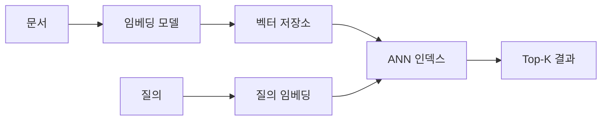

# 벡터 데이터베이스와 임베딩: 성능 최적화 중심 정리

- **임베딩 차원과 모델 선택**이 저장 공간, 검색 지연 시간, 정확도를 좌우한다.
- **HNSW·IVF 같은 근사 최근접 탐색(ANN)** 으로 전체 스캔을 피하되, 정확도와 지연 시간의 균형을 조정한다.
- 성능은 인덱스뿐 아니라 **메타데이터 필터, 배치 처리, 캐시, 하드웨어, 측정 지표**까지 함께 최적화해야 한다.

## 개념 설명

임베딩은 문장·이미지·상품 등을 고정 길이의 숫자 벡터로 표현한 것이다. 의미가 유사한 데이터는 벡터 공간에서 가까운 위치에 배치되며, 코사인 유사도나 내적(dot product), 유클리드 거리로 유사도를 계산한다.

벡터 데이터베이스는 벡터와 원본 데이터, 메타데이터를 저장하고 **Top-K 유사 벡터 검색**을 제공한다. 단순 선형 검색은 벡터가 `N`개이고 차원이 `D`일 때 대략 `O(ND)` 비용이 발생하므로 데이터가 커지면 느려진다. ANN 인덱스는 일부 후보만 탐색해 지연 시간을 줄인다.

대표적으로 HNSW는 그래프 탐색 기반이며 검색 정확도와 속도가 좋지만 메모리 사용량과 인덱스 구축 비용이 크다. `ef_search`를 높이면 재현율은 좋아지지만 지연 시간이 증가한다. IVF는 벡터를 여러 클러스터로 나누고 일부 클러스터만 검색한다. `nprobe`를 높이면 정확도는 상승하지만 검색 범위와 비용도 커진다.

성능 최적화 시 먼저 p95·p99 지연 시간, QPS, Recall@K를 측정한다. 임베딩 차원을 낮추거나 양자화하면 메모리와 네트워크 비용을 줄일 수 있지만 품질 저하를 검증해야 한다. 메타데이터 필터가 자주 사용된다면 필터 선택도를 고려해 별도 인덱스를 만들고, 검색 전 후보를 과도하게 줄여 Recall이 떨어지지 않는지 확인한다. 임베딩 생성은 요청 단위보다 배치 처리하고, 동일 입력은 캐시한다.

```python
# 예: HNSW 검색 파라미터 튜닝
index = HNSW(dim=768, metric="cosine", M=16, ef_construction=200)
index.add(vectors)

index.set_ef_search(64)       # 지연 시간과 Recall의 절충
hits = index.search(query, k=10, filter={"lang": "ko"})

# 운영에서는 p95 latency와 Recall@10을 함께 비교
```



## 면접 질문

### 1. HNSW의 `ef_search`를 높이면 어떤 변화가 생기나요?

탐색 후보가 늘어 Recall과 정확도가 높아질 가능성이 있지만, CPU 사용량과 검색 지연 시간도 증가한다. 따라서 p95 지연 시간과 Recall@K를 함께 측정해 결정한다.

### 2. 벡터 검색이 갑자기 느려질 때 무엇을 확인하나요?

인덱스 메모리 적재 여부, 벡터 수 증가, 검색 파라미터(`ef_search`, `nprobe`), 메타데이터 필터, 임베딩 차원, 동시 요청 수와 p99 지연 시간을 순서대로 확인한다.

## 한 줄 정리

**벡터 검색 성능은 ANN 파라미터, 임베딩 크기, 필터 설계와 운영 지표를 함께 튜닝해야 확보된다.**
