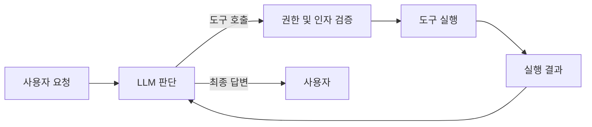

# AI 에이전트와 도구 사용

- **에이전트**는 목표를 달성하기 위해 상황을 관찰하고, 계획을 세우며, 도구를 호출하고 결과에 따라 반복적으로 행동한다.
- **도구 사용**은 검색, DB 조회, API 호출, 코드 실행 등을 모델의 출력과 분리해 실행하는 구조다.
- 실무 핵심은 자율성보다 **권한 제한, 입력 검증, 재시도, 타임아웃, 감사 로그, 사람 승인**이다.

## 개념 설명

일반적인 챗봇은 질문에 대한 텍스트를 생성하지만, 에이전트는 `관찰 → 판단 → 행동 → 결과 관찰` 루프를 수행한다. 모델이 직접 외부 시스템을 조작하는 것이 아니라, 사용할 수 있는 도구의 이름·설명·인자 스키마를 전달하고 구조화된 호출을 받는다. 실제 실행은 애플리케이션이 담당한다.

예를 들어 “지난달 환불 내역을 찾아 요약해줘”라는 요청은 인증 확인, DB 조회, 결과 필터링, 요약 생성 단계로 나뉜다. 도구 결과가 실패하면 재시도하거나 사용자에게 추가 정보를 요청할 수 있다.

면접에서는 에이전트를 단순한 LLM 호출과 구분하는 것이 중요하다. RAG는 주로 지식 검색을 보강하는 패턴이고, 에이전트는 검색 외에도 여러 도구를 선택하고 실행하는 의사결정 루프다. 또한 무한 루프를 막기 위해 최대 반복 횟수와 비용·시간 예산을 둔다.

도구는 최소 권한 원칙으로 제공해야 한다. 읽기 전용 API와 결제·삭제 API를 분리하고, 위험한 작업은 최종 확인이나 사람 승인을 요구한다. 외부 문서에 포함된 프롬프트 인젝션을 명령으로 신뢰하지 않으며, 인자 타입과 접근 권한을 서버에서 다시 검증한다.

## 간단한 도구 호출 예시

```python
def run_agent(question, llm, tools):
    messages = [{"role": "user", "content": question}]
    for _ in range(5):  # 무한 루프 방지
        result = llm.chat(messages, tool_schemas=tools.schemas())
        if result.text:
            return result.text
        call = result.tool_call
        tool = tools.get(call.name)
        args = tool.validate(call.arguments)
        output = tool.execute(args, timeout=3)
        messages += [result.message,
                     {"role": "tool", "name": call.name,
                      "content": str(output)}]
    raise RuntimeError("agent step limit exceeded")
```



## 면접 질문

### 1. LLM이 도구를 직접 실행하게 하면 안 되는 이유는?

LLM 출력은 신뢰할 수 없는 데이터이므로 직접 실행하지 않는다. 애플리케이션이 도구 이름과 인자를 검증하고, 인증·권한·타임아웃·감사 로그를 적용한 뒤 실행해야 한다.

### 2. 에이전트의 무한 실행과 잘못된 작업을 어떻게 방지하나요?

최대 반복 횟수, 시간·토큰·비용 예산, 재시도 횟수를 제한한다. 도구를 최소 권한으로 노출하고, 삭제·결제 같은 부작용 작업에는 멱등성 키와 사람 승인을 적용한다.

## 한 줄 정리

**AI 에이전트는 LLM의 판단 루프와 안전하게 통제된 외부 도구 실행을 결합한 시스템이다.**
