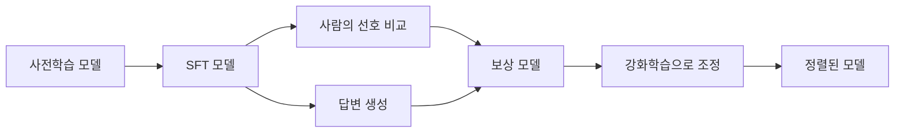

# RLHF(Reinforcement Learning from Human Feedback)

- **목표:** 사람의 선호를 반영해 언어 모델의 답변을 더 유용하고 안전하게 만든다.
- **핵심 흐름:** 사람의 비교 평가 → 보상 모델 학습 → 강화학습으로 언어 모델 조정.
- **주의점:** 사람의 판단과 평가 기준에 의존하므로 편향, 과도한 거절, 보상 해킹이 발생할 수 있다.

## 개념 설명

RLHF는 **사람의 피드백을 이용한 강화학습**이다. 초보자에게는 “시험 답안을 잘 채점하는 선생님에게 모델을 훈련시키는 과정”으로 생각하면 쉽다.

먼저 사전학습 모델은 인터넷 문장을 많이 읽어 문장을 이어 쓰는 능력을 얻는다. 하지만 문법적으로 자연스러운 답이 항상 질문에 친절하거나 안전한 것은 아니다. 그래서 사람이 작성한 모범 답안으로 **SFT(Supervised Fine-Tuning)** 를 수행한다.

다음으로 같은 질문에 대한 여러 답변을 사람이 비교한다. 예를 들어 답변 A는 정확하지만 무례하고, 답변 B는 정확하면서 이해하기 쉽다면 사람이 B를 선호한다고 표시한다. 이 데이터를 이용해 “어떤 답변이 더 좋은가?”를 예측하는 **보상 모델(Reward Model)** 을 만든다.

마지막으로 언어 모델이 답변을 만들면 보상 모델이 점수를 준다. 모델은 높은 점수를 받는 방향으로 업데이트된다. 식당 직원이 손님의 만족도 평가를 보고 서비스를 개선하는 것과 비슷하다. 일반적으로 PPO 같은 강화학습 알고리즘과 KL 제약을 사용해 원래 모델에서 너무 멀어지지 않도록 한다.

RLHF는 챗봇의 지시 따르기, 말투, 유해 요청 거절 등에 효과적이다. 그러나 보상 모델이 평가 기준을 완벽히 이해하지 못하면 모델이 실제 품질보다 “좋아 보이는 표현”만 최적화할 수 있다. 이를 **보상 해킹**이라고 한다. 따라서 사람의 평가 품질, 데이터 다양성, 자동 평가와 안전 테스트가 중요하다.

## 면접 질문

### 1. RLHF의 세 가지 주요 단계는 무엇인가요?

**답:** 사람의 모범 답안으로 SFT를 수행하고, 사람의 선호 데이터로 보상 모델을 학습한 뒤, 보상 점수를 최대화하도록 언어 모델을 강화학습한다.

### 2. RLHF의 대표적인 한계는 무엇인가요?

**답:** 사람의 선호 편향이 모델에 반영될 수 있고, 보상 모델의 허점을 이용해 실제로 유용하지 않은 답변을 생성하는 보상 해킹이 발생할 수 있다.

> **한 줄 정리:** RLHF는 사람의 “좋은 답변” 판단을 보상으로 바꾸어 언어 모델의 행동을 조정하는 방법이다.
