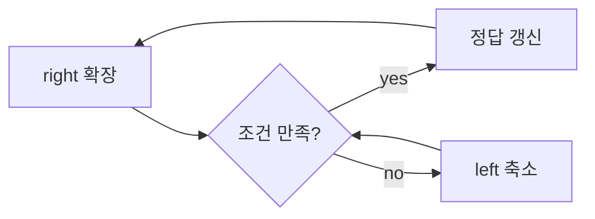

# Two Pointers와 Sliding Window

- **핵심은 중복 탐색 제거**: 한 번 본 원소를 다시 보지 않아 평균적으로 `O(N)`에 가깝게 만든다.
- **성능 최적화에 강함**: 브루트포스의 `O(N^2)`를 `O(N)` 또는 `O(N log N)` 수준으로 낮추는 대표 기법이다.
- **구현 포인트는 불변식 유지**: 포인터/윈도우가 항상 “현재 조건을 만족하는 상태”를 유지하도록 설계해야 한다.

## 개념 설명

**Two Pointers**는 두 개의 인덱스를 양끝 또는 같은 방향으로 움직이며 조건을 만족하는 쌍/구간을 찾는 방식이다. 정렬된 배열에서 합이 목표값인 쌍을 찾는 문제처럼, 한 번 이동한 포인터는 되돌리지 않아 탐색량을 줄인다.  
**Sliding Window**는 연속 구간의 조건을 유지하며 구간 크기를 확장/축소하는 방식이다. “최대 길이의 연속 부분배열”, “합이 K 이상인 최소 구간”처럼 **연속성**이 있을 때 특히 유리하다.

성능 관점에서 중요한 점은, 윈도우를 늘릴 때와 줄일 때의 비용을 `O(1)`로 유지하는 것이다. 예를 들어 합을 매번 다시 계산하면 이득이 사라지므로, 현재 합/빈도표를 누적 관리해야 한다. 이때 `deque`보다 단순 인덱스와 누적값이 더 빠른 경우가 많고, 캐시 친화적이라 실전 성능도 좋다.

또한 Two Pointers는 정렬 여부에 따라 적용 가능성이 갈린다. 정렬되어 있으면 방향성을 이용해 한쪽 포인터를 확정적으로 이동할 수 있지만, 비정렬이면 해시와 결합하는 경우가 많다. 면접에서는 “왜 O(N)인지”, “중복 계산을 어떻게 제거하는지”를 설명할 수 있어야 한다.

```python
def max_sum_len_k(arr, k):
    s = 0
    best = 0
    for i, x in enumerate(arr):
        s += x
        if i >= k:
            s -= arr[i - k]
        if i >= k - 1:
            best = max(best, s)
    return best
```



## 면접 질문

1. **Two Pointers와 Sliding Window의 차이는?**  
   Two Pointers는 더 넓은 개념이고, Sliding Window는 연속 구간에 특화된 Two Pointers이다.

2. **슬라이딩 윈도우가 빠른 이유는?**  
   매번 전체 구간을 재계산하지 않고, 추가/삭제된 값만 반영해 `O(1)`로 상태를 갱신하기 때문이다.

**한 줄 요약:**
중복 계산을 없애고 상태를 증분 갱신하면, Two Pointers와 Sliding Window는 최적화 효과가 가장 큰 탐색 기법이 된다.
