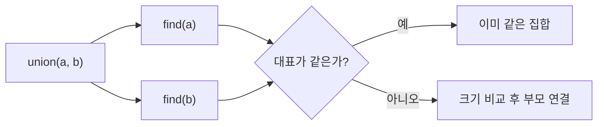

# Union-Find(Disjoint Set Union)

- 서로소 집합을 관리하며, 두 원소가 같은 그룹인지 빠르게 확인한다.
- `find`는 대표 노드를 찾고, `union`은 두 그룹을 합친다.
- 경로 압축과 union by size/rank를 함께 사용하면 연산당 평균 시간 복잡도는 `O(α(N))`으로 사실상 상수 시간이다.

## 개념 설명

Union-Find는 여러 원소를 서로 겹치지 않는 집합으로 나누고, 집합 간 연결 관계를 관리하는 자료구조다. 초기에는 모든 원소가 자기 자신을 대표로 가지는 독립 집합이다. 두 원소를 연결하면 각 집합의 대표를 찾아 하나의 집합으로 합친다.

핵심 연산은 두 가지다. `find(x)`는 `x`가 속한 집합의 대표를 반환한다. 대표가 같으면 두 원소는 같은 집합에 속한다. `union(a, b)`는 `a`, `b`의 대표가 다를 때 두 집합을 병합한다.

트리 형태로 부모를 저장하며, `parent[x] == x`이면 `x`가 대표다. `find` 수행 중 부모를 대표로 직접 바꾸는 **경로 압축**을 적용하면 다음 탐색이 빨라진다. 또한 작은 트리를 큰 트리 아래에 붙이는 **union by size**를 사용하면 트리가 불필요하게 깊어지는 것을 막을 수 있다.

대표적인 활용 사례는 크루스칼 최소 신장 트리, 네트워크 연결성 검사, 사이클 탐지, 온라인으로 추가되는 친구 관계나 도로 연결 문제다. 단, 집합을 분리하거나 연결 삭제를 처리하는 기능은 기본 Union-Find만으로 어렵다.

## 코드 예제

```python
class DSU:
    def __init__(self, n):
        self.parent = list(range(n))
        self.size = [1] * n

    def find(self, x):
        if self.parent[x] != x:
            self.parent[x] = self.find(self.parent[x])
        return self.parent[x]

    def union(self, a, b):
        a, b = self.find(a), self.find(b)
        if a == b:
            return False
        if self.size[a] < self.size[b]:
            a, b = b, a
        self.parent[b] = a
        self.size[a] += self.size[b]
        return True

dsu = DSU(5)
dsu.union(0, 1)
dsu.union(1, 2)
print(dsu.find(0) == dsu.find(2))  # True
```

## 동작 흐름



## 면접 질문

### 1. 경로 압축만 사용해도 충분한가?

정확성에는 문제가 없지만 최악의 경우 트리가 길어질 수 있다. 경로 압축과 union by size 또는 rank를 함께 사용해야 안정적으로 거의 상수 시간 성능을 얻는다.

### 2. Union-Find로 방향 그래프의 사이클을 판별할 수 있는가?

일반적으로 무방향 그래프의 사이클 판별에 적합하다. 간선을 추가하기 전에 두 정점의 대표가 같다면 이미 연결된 경로가 있어 해당 간선이 사이클을 만든다. 방향 그래프는 DFS의 방문 상태나 위상 정렬을 주로 사용한다.

## 한 줄 정리

Union-Find는 **경로 압축과 크기 기반 병합으로 동적 연결 관계를 빠르게 관리하는 자료구조**다.
