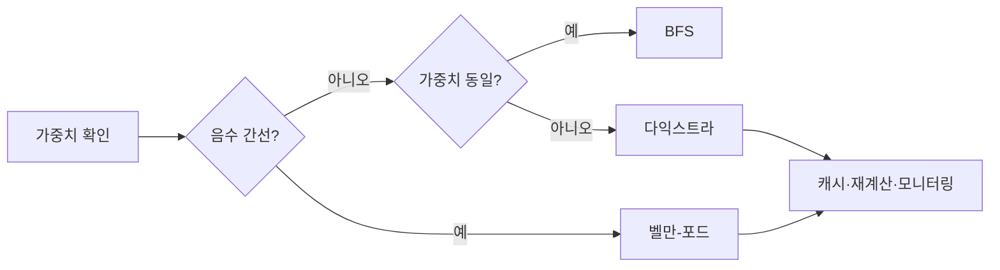

# 최단 경로 알고리즘

- **가중치가 없으면 BFS**, 모든 가중치가 음수가 아니면 **다익스트라**, 음수 간선이 있으면 **벨만-포드**를 우선 검토한다.
- 현업에서는 지도·물류뿐 아니라 네트워크 라우팅, 서비스 호출 비용 최소화, 게임 NPC 이동, 배치 작업 순서 최적화에 활용된다.
- 알고리즘 선택보다 **가중치 의미, 데이터 규모, 변경 빈도, 지연 시간 요구사항**을 함께 판단하는 것이 중요하다.

## 개념 설명

최단 경로 문제는 그래프의 시작 정점에서 목적지까지 이동 비용의 합이 최소가 되는 경로를 찾는 문제다. 정점은 도시·서버·서비스·상태를, 간선은 도로·네트워크 연결·API 호출을 나타낸다. 가중치는 거리뿐 아니라 지연 시간, 비용, 위험도, 탄소 배출량 등으로 정의할 수 있다.

**BFS**는 모든 간선 비용이 동일할 때 최단 간선 수를 보장한다. 예를 들어 소셜 네트워크에서 “친구의 친구” 단계 수를 계산하거나, 격자 게임에서 이동 횟수를 구할 때 적합하다. 시간 복잡도는 `O(V+E)`다.

**다익스트라**는 음수 가중치가 없는 그래프에서 우선순위 큐로 가장 가까운 정점을 반복 확정한다. 도로 길찾기, 클라우드 리전 간 네트워크 지연 최소화, 마이크로서비스 호출 경로 최적화에 사용된다. 힙을 사용하면 일반적으로 `O((V+E) log V)`다. 실시간 지도 서비스는 전체 그래프를 매번 계산하기보다 지역별 캐시, 계층형 그래프, A*를 함께 사용한다.

**A\***는 다익스트라에 목적지까지의 추정 비용인 휴리스틱을 더한 방식이다. 좌표가 있는 지도나 게임 맵에서 탐색 영역을 줄이는 데 유리하지만, 휴리스틱이 실제 비용을 초과하면 최적 경로를 보장하지 못할 수 있다.

**벨만-포드**는 음수 가중치를 처리하고 음수 사이클도 탐지하지만 느리다. 환율 차익 거래나 시간 오프셋 모델처럼 음수 비용이 의미 있는 경우에 선택한다. 여러 출발지에서 모든 정점까지의 최단 거리는 플로이드-워셜 또는 다중 다익스트라를 고려한다.

운영 환경에서는 간선 변경 시 재계산 비용, 장애로 인한 경로 무효화, 타임아웃, 캐시 일관성을 함께 설계해야 한다. 또한 비용이 실제 업무 목적을 잘 반영하는지 모니터링해야 한다.

## 코드 예시: 다익스트라

```python
import heapq

def dijkstra(graph, start):
    dist = {v: float("inf") for v in graph}
    dist[start] = 0
    pq = [(0, start)]
    while pq:
        cost, node = heapq.heappop(pq)
        if cost != dist[node]:
            continue
        for nxt, weight in graph[node]:
            new_cost = cost + weight
            if new_cost < dist[nxt]:
                dist[nxt] = new_cost
                heapq.heappush(pq, (new_cost, nxt))
    return dist
```

## 흐름



## 면접 질문

**Q1. 다익스트라가 음수 간선에서 동작하지 않는 이유는?**  
A. 한 번 확정한 정점보다 더 짧은 경로가 나중에 발견될 수 있어 탐욕적 확정이 깨지기 때문이다.

**Q2. BFS와 다익스트라의 차이는?**  
A. BFS는 동일 비용 간선에서 레벨 순서로 탐색하고, 다익스트라는 가중치가 다른 간선의 누적 비용을 우선순위 큐로 비교한다.

> **한 줄 정리:** 최단 경로는 그래프보다 먼저 비용의 의미와 운영 조건을 정의하고, 그에 맞는 알고리즘을 선택해야 한다.
