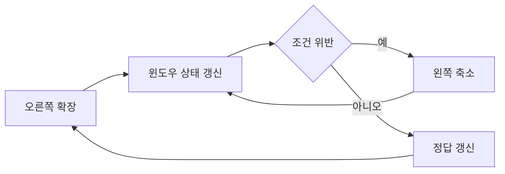

# 투 포인터와 슬라이딩 윈도우

- **투 포인터**는 배열의 두 위치를 가리키며 포인터를 단조롭게 이동해 탐색 범위를 줄이는 기법이다.
- **슬라이딩 윈도우**는 투 포인터의 한 형태로, 연속 구간을 유지하며 오른쪽 확장과 왼쪽 축소를 반복한다.
- 핵심은 포인터 이동 조건과 윈도우의 **불변식**을 명확히 정의하는 것이다. 잘못 정의하면 누락, 중복, 무한 루프가 발생한다.

## 개념 설명

투 포인터는 보통 정렬된 배열에서 합, 중복, 구간 조건을 처리할 때 사용한다. 예를 들어 양끝에서 시작해 합이 작으면 왼쪽을 증가시키고, 크면 오른쪽을 감소시킨다. 정렬되지 않은 배열에 이 규칙을 그대로 적용하면 값의 대소 관계가 보장되지 않아 오답이 된다.

슬라이딩 윈도우는 `[left, right]`라는 연속 구간을 관리한다. `right`를 증가시켜 원소를 추가하고, 조건을 위반하면 `left`를 이동해 구간을 줄인다. 각 포인터가 최대 한 번씩 전진하면 전체 시간 복잡도는 보통 `O(N)`이다.

자주 하는 실수는 다음과 같다.

1. **음수가 포함된 합 문제에 적용**: “합이 작으면 확장, 크면 축소”는 모든 원소가 양수일 때만 성립한다. 음수가 있으면 포인터 이동 후 합의 방향이 예측되지 않는다. 이 경우 누적합과 해시맵, 덱 등을 검토한다.
2. **조건을 한 번만 확인**: 윈도우가 조건을 만족할 때까지 축소해야 하므로 `if`가 아니라 `while`이 필요한 경우가 많다.
3. **갱신 순서 오류**: 왼쪽 원소를 제거하기 전에 길이·정답을 갱신하거나, 오른쪽 원소를 자료구조에 넣기 전에 검사하면 경계가 어긋난다.
4. **중복 상태를 되돌리지 않음**: 빈도 맵, 합, 카운터를 `left` 이동과 함께 반드시 갱신해야 한다.
5. **정답 초기화 실수**: 최소값 문제는 큰 값으로, 최대값 문제는 작은 값으로 시작한다. 유효한 구간이 없는 경우도 별도로 처리한다.
6. **불필요한 재계산**: 매번 구간 합이나 중복 여부를 다시 계산하면 `O(N²)`가 된다. 윈도우에 들어오고 나가는 값만 반영한다.
7. **포인터가 멈추는 조건**: 한 반복에서 적어도 하나의 포인터가 이동하는지 확인한다. 그렇지 않으면 무한 루프가 된다.

```python
def min_len_at_least(target, nums):  # 모든 수가 양수
    left = total = 0
    answer = float("inf")
    for right, value in enumerate(nums):
        total += value
        while total >= target:
            answer = min(answer, right - left + 1)
            total -= nums[left]
            left += 1
    return 0 if answer == float("inf") else answer
```



## 면접 질문

### 1. 투 포인터와 슬라이딩 윈도우의 차이는?

투 포인터는 두 인덱스를 활용하는 넓은 기법이고, 슬라이딩 윈도우는 그중 연속 구간을 유지하는 유형이다. 모든 투 포인터가 윈도우 문제인 것은 아니다.

### 2. 슬라이딩 윈도우를 적용할 수 있는지 어떻게 판단하는가?

구간을 한 칸 이동할 때 추가·삭제되는 원소만으로 상태를 갱신할 수 있고, 조건 위반 시 한 방향으로 윈도우를 줄여도 해를 놓치지 않아야 한다. 음수처럼 단조성을 깨는 요소가 있으면 적용 가능성을 다시 검증한다.

> **한 줄 정리:** 포인터를 움직이는 규칙보다 먼저, 윈도우 불변식과 원소 제약을 정의하라.
