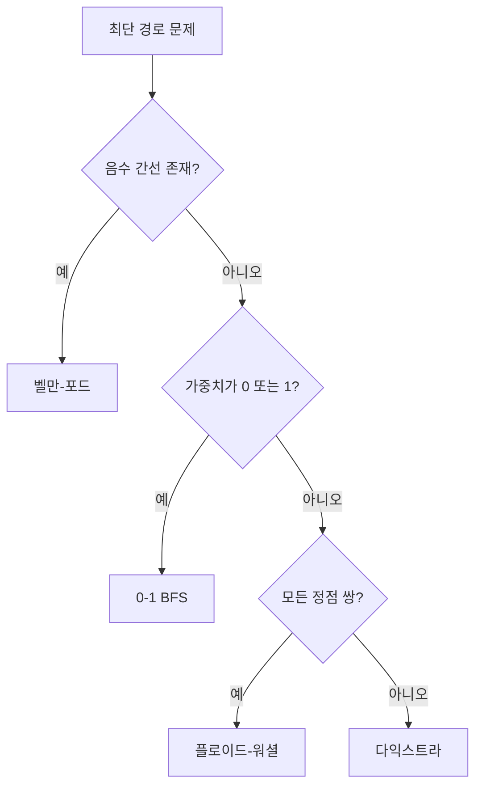

# 최단 경로 알고리즘

- **가중치가 음수가 없으면 다익스트라**, 음수 간선이 있으면 **벨만-포드**를 우선 검토한다.
- 간선 비용이 `0` 또는 `1`뿐이면 **0-1 BFS**, 모든 정점 쌍의 거리가 필요하면 **플로이드-워셜**이 적합하다.
- 핵심 구현은 `dist` 배열, 우선순위 큐, **완화(relaxation)** 이며, 방문 처리 방식이 시간 복잡도와 정답을 결정한다.

## 개념 설명

최단 경로 문제는 시작 정점에서 목적지까지의 누적 가중치가 최소가 되는 경로를 찾는 문제다. 그래프는 인접 리스트로 저장하는 것이 일반적이다. 정점 수가 `V`, 간선 수가 `E`일 때 인접 리스트는 공간 `O(V+E)`를 사용하며 희소 그래프에 유리하다.

**다익스트라**는 현재까지 거리가 가장 작은 정점을 확정하고, 그 정점에서 나가는 간선을 완화한다. 최소 거리 정점을 빠르게 꺼내기 위해 최소 힙을 사용한다. 힙에는 같은 정점이 여러 번 들어갈 수 있으므로, 꺼낸 거리 `d`가 `dist[u]`보다 크면 오래된 항목으로 판단해 건너뛴다. 음수 간선이 있으면 이미 확정한 경로가 이후 더 짧아질 수 있어 사용할 수 없다. 복잡도는 인접 리스트와 힙 기준 `O((V+E) log V)`다.

**벨만-포드**는 모든 간선을 `V-1`번 반복 완화한다. 마지막에 한 번 더 완화가 가능하면 음수 사이클이 존재한다. 구현은 단순하지만 `O(VE)`로 느리다. **플로이드-워셜**은 `dist[i][j]` 행렬을 두고 중간 정점 `k`를 하나씩 허용하며 `dist[i][j] = min(dist[i][j], dist[i][k] + dist[k][j])`를 수행한다. `O(V³)`이므로 정점 수가 작은 모든 쌍 문제에 적합하다.

경로 자체가 필요하면 `prev[v] = u`를 기록한 뒤 목적지에서 역추적한다. 큰 간선 비용에서는 합산 중 오버플로를 방지하도록 충분히 큰 정수형과 `INF`를 사용해야 한다.

## 다익스트라 구현

```python
import heapq

def dijkstra(graph, start):
    INF = 10**18
    dist = [INF] * len(graph)
    dist[start] = 0
    pq = [(0, start)]
    while pq:
        d, u = heapq.heappop(pq)
        if d != dist[u]:
            continue
        for v, w in graph[u]:
            nd = d + w
            if nd < dist[v]:
                dist[v] = nd
                heapq.heappush(pq, (nd, v))
    return dist
```

## 알고리즘 선택 흐름



## 면접 질문

### 1. 다익스트라에서 방문 배열만으로 처리하면 왜 위험한가?

우선순위 큐에는 동일 정점의 오래된 거리와 최신 거리가 함께 존재할 수 있다. 따라서 `visited`보다 `d != dist[u]` 같은 stale entry 검사가 안전하다. 정점이 처음 큐에서 나올 때 확정된다는 성질은 음수 간선이 없을 때만 성립한다.

### 2. 다익스트라와 벨만-포드의 차이는?

다익스트라는 최소 거리 정점을 선택하는 탐욕 알고리즘이며 음수 간선을 처리하지 못한다. 벨만-포드는 모든 간선을 반복 완화해 음수 간선과 음수 사이클을 탐지할 수 있지만 더 느리다.

**한 줄 정리:** 음수 간선이 없으면 힙 기반 다익스트라, 특수 가중치는 0-1 BFS, 음수 간선은 벨만-포드로 선택한다.
