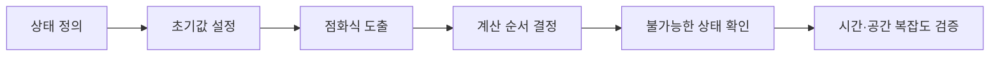

# 동적 계획법(Dynamic Programming)과 자주 하는 실수

- **핵심은 상태 정의**다. `dp[i]`가 무엇을 의미하는지 한 문장으로 설명할 수 있어야 한다.
- **점화식과 초기값은 한 세트**다. 둘 중 하나라도 모호하면 오답 가능성이 높다.
- **중복 계산을 제거**하는 것이 목적이지, 모든 재귀 문제에 DP를 붙이는 것이 목적은 아니다.

## 개념 설명

동적 계획법(DP)은 문제를 작은 부분 문제로 나누고, 각 부분 문제의 결과를 저장해 중복 계산을 피하는 기법이다. 적용 조건은 보통 **최적 부분 구조**와 **부분 문제의 중복**이다.

먼저 상태를 정의한다. 예를 들어 `dp[i]`를 “금액 `i`를 만드는 데 필요한 동전의 최소 개수”라고 정하면, 동전 `c`를 마지막에 사용했을 때 `dp[i] = dp[i-c] + 1`이라는 전이가 자연스럽게 나온다. 이후 초기값, 계산 순서, 불가능한 상태의 표현을 결정한다.

메모이제이션은 재귀 결과를 저장하는 하향식 방식이고, 타뷸레이션은 작은 상태부터 표를 채우는 상향식 방식이다. 상향식은 재귀 깊이 문제를 피하기 쉽고 반복문으로 계산 순서를 명확히 통제할 수 있다.

### 자주 하는 실수와 안티패턴

1. **상태가 문제를 충분히 표현하지 못함**: 현재 위치만 저장했지만 방문한 집합, 마지막 선택, 남은 횟수도 필요한 경우가 있다. 상태를 축소하면 서로 다른 상황을 같은 값으로 취급하게 된다.
2. **탐욕법을 DP처럼 사용함**: 매 순간 가장 좋아 보이는 선택이 전체 최적이라는 보장은 없다. 동전 단위가 임의일 때 큰 동전부터 고르는 방식은 실패할 수 있다.
3. **초기값 오류**: 최소화 문제에서 `0`으로 초기화하면 아직 계산하지 않은 상태가 정답처럼 선택된다. `INF` 또는 불가능한 값으로 초기화하라.
4. **전이 방향 오류**: 0/1 배낭은 같은 물건을 한 번만 써야 하므로 용량을 큰 방향으로 순회한다. 작은 방향으로 순회하면 물건을 여러 번 사용하게 된다.
5. **갱신 중 원본 훼손**: 한 차원 배열을 재사용할 때 순회 방향을 잘못 잡으면 현재 단계의 값이 다음 전이에 섞인다.
6. **무조건 DP 적용**: 상태 수가 너무 많거나 부분 문제가 겹치지 않으면 메모리와 시간이 더 커진다. 상태 수와 전이 수를 먼저 계산하라.
7. **불가능한 상태를 출력**: `INF`가 남았는지 확인하지 않고 결과를 출력하면 존재하지 않는 해를 정답으로 내보낼 수 있다.

## 코드 예시

```python
def coin_change(coins, amount):
    INF = amount + 1
    dp = [INF] * (amount + 1)
    dp[0] = 0

    for total in range(1, amount + 1):
        for coin in coins:
            if total >= coin:
                dp[total] = min(dp[total], dp[total - coin] + 1)

    return -1 if dp[amount] == INF else dp[amount]
```



## 면접 질문

### 1. 메모이제이션과 타뷸레이션의 차이는?

메모이제이션은 재귀 기반 하향식으로 필요한 상태만 계산하고, 타뷸레이션은 반복문 기반 상향식으로 상태를 순서대로 계산한다. 후자는 재귀 호출 비용과 스택 오버플로를 피하기 쉽다.

### 2. 0/1 배낭에서 용량을 역순으로 순회하는 이유는?

현재 물건을 처리하는 동안 갱신된 값을 다시 사용하면 같은 물건을 여러 번 선택하게 된다. 큰 용량부터 갱신하면 이전 물건까지의 값만 참조할 수 있어 1회 선택 조건이 유지된다.

## 한 줄 정리

**DP는 점화식보다 먼저 상태를 정확히 정의하고, 초기값·순회 방향·불가능한 상태를 함께 검증하는 문제 해결 방식이다.**
