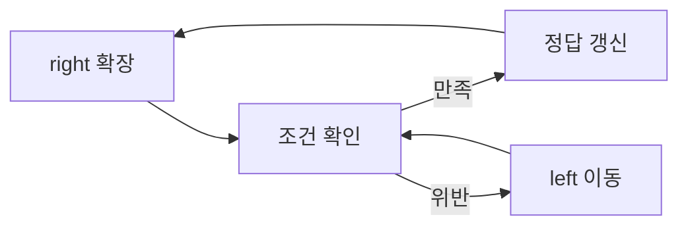

# 투 포인터와 슬라이딩 윈도우

- **투 포인터**는 배열의 두 위치를 가리키며 탐색 범위를 효율적으로 줄이는 기법이다.
- **슬라이딩 윈도우**는 투 포인터의 응용으로, 연속된 구간을 유지하며 왼쪽과 오른쪽 포인터를 이동한다.
- 포인터가 대부분 한 방향으로만 이동하면 전체 시간 복잡도를 **O(N)**으로 낮출 수 있다.

## 개념 설명

투 포인터는 주로 정렬된 배열에서 두 수의 합, 중복 제거, 구간 탐색 문제에 사용한다. `left`, `right`를 양끝에서 시작해 조건에 따라 안쪽으로 이동하는 방식이 대표적이다. 정렬되어 있으므로 합이 작으면 `left`를 증가시키고, 합이 크면 `right`를 감소시킬 수 있다.

슬라이딩 윈도우는 `[left, right]` 구간 자체를 관리한다. `right`를 확장해 원소를 포함하고, 윈도우가 조건을 위반하면 `left`를 이동해 조건을 회복한다. 고정 크기 윈도우는 매번 구간의 합이나 최댓값을 갱신하고, 가변 크기 윈도우는 중복 여부, 합의 범위, 허용 개수 등을 기준으로 크기를 조절한다.

핵심은 **윈도우가 항상 어떤 불변식(invariant)을 만족하도록 유지하는 것**이다. 예를 들어 “현재 구간에 중복 문자가 없다”는 조건을 유지하면서 길이의 최댓값을 갱신한다. 각 원소가 오른쪽 포인터와 왼쪽 포인터에 의해 최대 한 번씩 처리되므로 시간 복잡도는 O(N)이다. 단, 음수가 포함된 부분 배열 합 문제처럼 윈도우 조건의 단조성이 깨지는 경우에는 투 포인터를 적용할 수 없으며, 누적 합이나 해시맵 등이 필요할 수 있다.

```python
def longest_unique(s):
    seen = set()
    left = 0
    answer = 0
    for right, ch in enumerate(s):
        while ch in seen:
            seen.remove(s[left])
            left += 1
        seen.add(ch)
        answer = max(answer, right - left + 1)
    return answer
```



## 면접 질문

### 1. 투 포인터와 슬라이딩 윈도우의 차이는 무엇인가?

투 포인터는 두 인덱스를 이용하는 넓은 기법이고, 슬라이딩 윈도우는 두 포인터로 **연속 구간을 유지하며 확장·축소하는 특수한 형태**다. 따라서 모든 투 포인터가 슬라이딩 윈도우는 아니다.

### 2. 슬라이딩 윈도우를 적용할 수 없는 대표적인 경우는?

포인터를 한 방향으로 이동해도 조건이 단조롭게 회복되지 않는 경우다. 예를 들어 음수가 섞인 배열에서 “합이 K 이상인 최소 길이”를 단순 윈도우로 해결하면, 원소를 제거했을 때 합이 반드시 감소한다는 보장이 없어 오답이 될 수 있다.

**한 줄 정리:** 연속 구간의 조건을 불변식으로 유지하며 각 포인터를 한 번씩만 이동시키면 O(N) 탐색이 가능하다.
