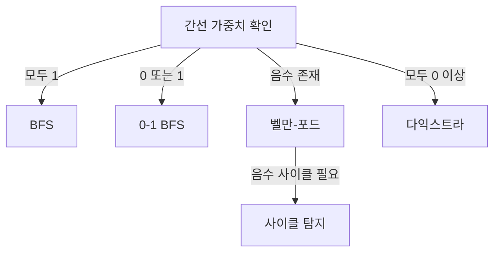

# 최단 경로 알고리즘

- **가중치가 모두 0 이상이면 다익스트라**, 음수 간선이 있으면 벨만-포드를 검토한다.
- **BFS는 모든 간선 가중치가 같거나 1일 때만** 최단 경로를 보장한다.
- 우선순위 큐에서는 오래된 원소를 반드시 무시하고, `INF` 및 거리 자료형의 오버플로를 주의한다.

## 개념 설명

최단 경로 문제는 시작 정점에서 다른 정점까지의 최소 비용을 구하는 문제다. 그래프가 방향성을 가지는지, 간선 가중치가 음수인지, 하나의 시작점인지 모든 정점 쌍인지에 따라 알고리즘을 선택한다.

| 조건 | 적합한 알고리즘 | 핵심 |
|---|---|---|
| 무가중치 또는 모든 가중치가 1 | BFS | 레벨 순서 탐색 |
| 가중치가 0 이상 | 다익스트라 | 가장 가까운 정점을 확정 |
| 음수 간선 존재 | 벨만-포드 | 음수 사이클 탐지 가능 |
| 모든 정점 쌍 | 플로이드-워셜 | 구현 단순, `O(V³)` |

다익스트라는 현재까지 가장 짧은 거리가 작은 정점을 선택해 인접 정점을 완화한다. 단, 음수 간선이 있으면 이미 확정한 정점의 거리가 나중에 더 작아질 수 있어 사용할 수 없다.

### 자주 하는 실수와 안티패턴

- **BFS를 가중치 그래프에 사용**: 간선 비용이 다르면 방문 횟수와 비용은 다르다. 0과 1만 있다면 0-1 BFS를 고려한다.
- **다익스트라에서 `visited`만 믿기**: 우선순위 큐에 같은 정점의 후보가 여러 개 들어간다. `if cost != dist[node]`로 오래된 후보를 건너뛰는 방식이 안전하다.
- **음수 간선에 다익스트라 적용**: 테스트가 단순할 때만 우연히 맞을 수 있어 위험하다.
- **큰 값으로 `INF`를 작게 설정**: 실제 최단 거리보다 작으면 갱신이 막힌다. 충분히 큰 정수와 넉넉한 자료형을 사용한다.
- **방향 그래프를 양방향으로 저장**: 입력이 방향 간선인지 확인한다. 반대로 양방향 간선을 누락하는 실수도 많다.
- **경로 자체가 필요한데 거리만 저장**: `parent[next] = current`를 기록한 뒤 목적지부터 역추적한다.
- **모든 정점 쌍에 다익스트라 반복**: 정점 수가 작으면 플로이드-워셜이 더 단순할 수 있고, 큰 희소 그래프라면 반복 다익스트라를 검토한다.

## 다익스트라 구현 예시

```python
import heapq

def dijkstra(graph, start):
    INF = 10**18
    dist = [INF] * len(graph)
    dist[start] = 0
    pq = [(0, start)]
    while pq:
        cost, u = heapq.heappop(pq)
        if cost != dist[u]:
            continue
        for v, weight in graph[u]:
            nxt = cost + weight
            if nxt < dist[v]:
                dist[v] = nxt
                heapq.heappush(pq, (nxt, v))
    return dist
```



## 면접 질문

**Q1. 다익스트라가 음수 간선에서 실패하는 이유는?**  
A. 한 번 확정한 정점의 거리가 이후 음수 간선을 통해 더 작아질 수 있기 때문이다. 다익스트라는 확정 이후 거리 불변을 전제로 한다.

**Q2. 다익스트라에서 우선순위 큐의 중복 원소를 왜 허용하는가?**  
A. decrease-key를 직접 구현하지 않고 새 후보를 삽입하기 때문이다. 따라서 꺼낸 비용이 현재 `dist`와 다르면 오래된 후보로 판단해 무시한다.

> **한 줄 정리:** 그래프의 가중치와 문제 범위를 먼저 확인하고, 알고리즘의 전제와 우선순위 큐의 오래된 상태 처리를 지켜라.
