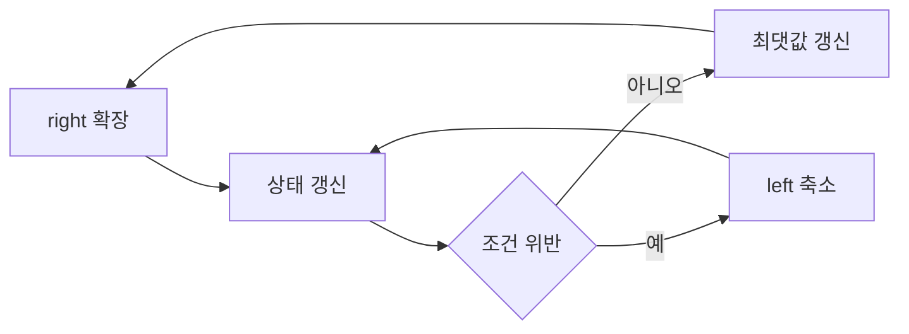

# 투 포인터와 슬라이딩 윈도우

- **투 포인터**는 배열의 두 위치를 가리키며 탐색 범위를 조절해 중복 순회를 줄이는 기법이다.
- **슬라이딩 윈도우**는 연속 구간을 유지하면서 오른쪽으로 확장하고, 조건이 깨지면 왼쪽을 축소한다.
- 각 원소를 최대 몇 번만 이동시키면 전체 시간 복잡도를 `O(n)`으로 낮출 수 있어 성능 최적화에 효과적이다.

## 개념 설명

투 포인터는 보통 `left`, `right` 포인터를 사용한다. 정렬된 배열에서 합을 비교하는 문제처럼 양 끝에서 시작하거나, 한 방향으로 두 포인터를 이동하며 구간을 관리한다. 핵심은 포인터가 뒤로 돌아가지 않는 것이다. 따라서 겉보기에는 반복문 안에 반복문이 있어도 각 포인터의 총 이동 횟수가 `O(n)`이면 전체 복잡도는 `O(n)`이다.

슬라이딩 윈도우는 투 포인터의 대표적인 응용이다. `right`를 증가시켜 새 원소를 포함하고, 중복·합·개수 같은 조건을 위반하면 `left`를 증가시켜 윈도우를 복구한다. 매 단계마다 전체 구간을 다시 계산하지 말고, 빈도 테이블·합계·카운터를 갱신해야 한다. 이 방식은 문자열, 부분 배열, 로그 스트림의 연속 구간 분석에 적합하다.

성능 측면에서는 불필요한 배열 복사, `slice`, 매번 정렬하는 연산을 피해야 한다. 자료구조 선택도 중요하다. 값의 범위가 작으면 해시맵보다 배열 카운터가 빠르고 메모리 효율적일 수 있다. 윈도우가 모든 원소를 한 번씩 추가·삭제하므로 평균 `O(n)`, 추가 공간은 상태 저장 크기에 따라 `O(k)` 또는 `O(문자 종류)`가 된다. 단, 정렬이 필요한 투 포인터는 정렬 비용 `O(n log n)`을 먼저 고려해야 한다.

## 코드 예시

```python
def longest_unique(s):
    last = {}
    left = best = 0

    for right, ch in enumerate(s):
        if ch in last and last[ch] >= left:
            left = last[ch] + 1
        last[ch] = right
        best = max(best, right - left + 1)

    return best

print(longest_unique("abcabcbb"))  # 3
```



## 면접 질문

### 1. 중첩 반복문이 있는데 왜 `O(n)`인가요?

`left`와 `right`가 각각 최대 `n`번만 증가하며 뒤로 이동하지 않기 때문이다. 전체 포인터 이동 횟수의 합이 `O(n)`이다.

### 2. 슬라이딩 윈도우를 적용할 수 없는 경우는?

윈도우를 한 방향으로 확장·축소해도 조건을 안정적으로 복구할 수 없는 경우다. 예를 들어 음수가 포함된 배열의 정확한 부분합 문제는 일반적인 누적합이나 해시맵이 더 적합할 수 있다.

## 한 줄 정리

> 포인터를 되돌리지 않고 상태를 증분 갱신하면, 연속 구간 탐색을 불필요한 재계산 없이 `O(n)`으로 최적화할 수 있다.
