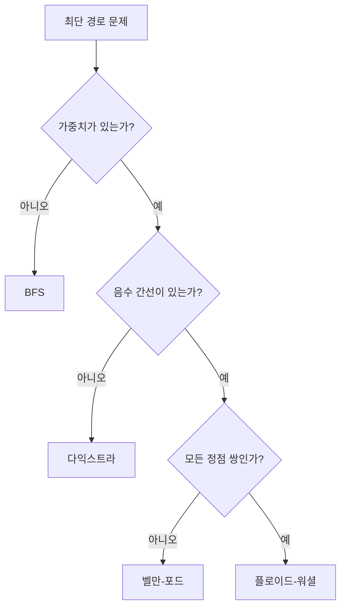

# 최단 경로 알고리즘

- **가중치가 없으면 BFS**, 모든 간선 가중치가 음수가 아니면 **다익스트라**, 음수 가중치가 있으면 **벨만–포드**를 우선 고려한다.
- 다익스트라는 방문한 정점의 최단 거리가 확정된다는 성질을 이용하므로, 음수 간선이 존재하면 이 성질이 깨진다.
- 시간 복잡도는 구현에 따라 다르다. 인접 리스트와 우선순위 큐를 사용하는 다익스트라는 `O((V+E) log V)`이다.

## 개념 설명

최단 경로 문제는 그래프에서 시작 정점부터 다른 정점까지의 최소 비용 경로를 찾는 문제다. 간선의 비용이 모두 같다면 거리가 곧 간선 수이므로 BFS가 `O(V+E)`에 해결한다.

**다익스트라 알고리즘**은 현재까지 가장 짧은 거리를 가진 정점을 선택하고, 그 정점에서 연결된 간선을 완화(relaxation)한다. 완화란 `dist[next] > dist[cur] + weight`일 때 더 작은 값으로 갱신하는 과정이다. 우선순위 큐를 사용하면 가장 가까운 정점을 빠르게 꺼낼 수 있다. 이미 처리한 값보다 큰 오래된 큐 원소는 무시해야 한다.

**벨만–포드**는 모든 간선을 최대 `V-1`번 반복해 완화하므로 음수 간선도 처리할 수 있다. 한 번 더 완화가 가능하면 음수 사이클이 존재한다. **플로이드–워셜**은 모든 정점 쌍의 최단 거리를 구하며 `O(V³)`이므로 정점 수가 작을 때 적합하다. 경로 자체가 필요하면 부모 정점 또는 다음 정점 배열을 함께 저장한다.

## 코드 예시: 다익스트라

```python
import heapq

def dijkstra(graph, start):
    dist = [float("inf")] * len(graph)
    dist[start] = 0
    pq = [(0, start)]
    while pq:
        cost, cur = heapq.heappop(pq)
        if cost != dist[cur]:
            continue
        for nxt, weight in graph[cur]:
            new_cost = cost + weight
            if new_cost < dist[nxt]:
                dist[nxt] = new_cost
                heapq.heappush(pq, (new_cost, nxt))
    return dist
```

## 알고리즘 선택 흐름



## 면접 질문

### 1. 다익스트라에서 음수 간선을 사용할 수 없는 이유는?

현재 가장 작은 거리를 가진 정점의 최단 거리가 확정되었다고 가정하기 때문이다. 이후 음수 간선을 거쳐 더 작은 경로가 발견될 수 있으면 이 가정이 깨진다. 음수 간선이 있으면 벨만–포드를 사용한다.

### 2. BFS와 다익스트라의 핵심 차이는?

BFS는 모든 간선 비용이 동일하다는 전제로 큐에 들어온 순서가 거리 순서와 같다. 다익스트라는 간선 비용이 다를 수 있으므로 우선순위 큐로 현재 비용이 가장 작은 정점을 선택한다.

> **한 줄 정리:** 간선 조건을 먼저 확인하고, 무가중치는 BFS, 음이 아닌 가중치는 다익스트라, 음수 가중치는 벨만–포드를 선택한다.
