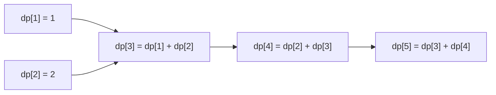

# 동적 계획법(Dynamic Programming, DP)

- **작은 문제의 답을 저장**해 같은 계산을 반복하지 않는다.
- **부분 문제의 최적해로 전체 문제의 최적해**를 구한다.
- 보통 `점화식`, `초기값`, `계산 순서`를 정하는 것이 핵심이다.

## 개념 설명

동적 계획법은 복잡한 문제를 작은 조각으로 나누고, 조각의 답을 메모해 두었다가 재사용하는 방법이다. 요리로 비유하면, 매번 양파를 새로 손질하는 대신 한 번 손질한 양파를 냉장고에 보관해 여러 요리에 사용하는 것과 같다.

DP를 적용하려면 보통 두 가지 조건을 확인한다.

1. **중복되는 부분 문제**: 같은 작은 문제를 여러 번 풀게 되는가?
2. **최적 부분 구조**: 큰 문제의 최적해가 작은 문제의 최적해로 구성되는가?

대표적인 예가 계단 오르기다. 한 번에 1칸 또는 2칸 올라갈 수 있다면, `n`번째 계단에 도착하는 방법은 `n-1`번째에서 1칸 올라오는 경우와 `n-2`번째에서 2칸 올라오는 경우의 합이다.

따라서 점화식은 `dp[n] = dp[n-1] + dp[n-2]`가 된다. `dp[i]`는 “i번째 계단까지 도착하는 방법의 수”라는 의미다. 처음에는 `dp[1]`, `dp[2]` 같은 초기값을 정하고, 작은 인덱스부터 차례로 계산한다.

DP 구현 방식은 크게 두 가지다. **메모이제이션**은 재귀 호출 결과를 저장하며, 필요한 상태만 계산한다. **타뷸레이션**은 작은 값부터 반복문으로 채워 재귀 호출 비용을 없앤다. 상태 수가 `N`개이고 각 상태를 한 번 계산한다면 시간 복잡도는 보통 `O(N)`이다. 이전 두 값만 필요하다면 배열 전체 대신 변수 두 개만 사용해 공간 복잡도를 `O(1)`로 줄일 수도 있다.

```python
def climb(n):
    if n <= 2:
        return n
    prev, cur = 1, 2
    for _ in range(3, n + 1):
        prev, cur = cur, prev + cur
    return cur

print(climb(5))  # 8
```



## 면접 질문

### 1. 재귀와 DP의 차이는 무엇인가요?

재귀는 같은 부분 문제를 반복 계산할 수 있지만, DP는 계산 결과를 저장해 재사용한다. 따라서 일반적으로 시간 복잡도를 크게 줄일 수 있다.

### 2. DP 문제를 풀 때 어떤 순서로 접근하나요?

`상태의 의미 정의 → 점화식 작성 → 초기값 설정 → 계산 순서 결정 → 시간·공간 복잡도 검토` 순서로 접근한다.

## 한 줄 요약

**DP는 작은 문제의 답을 저장해 중복 계산을 없애고, 그 답들을 조합해 큰 문제를 해결하는 방법이다.**
