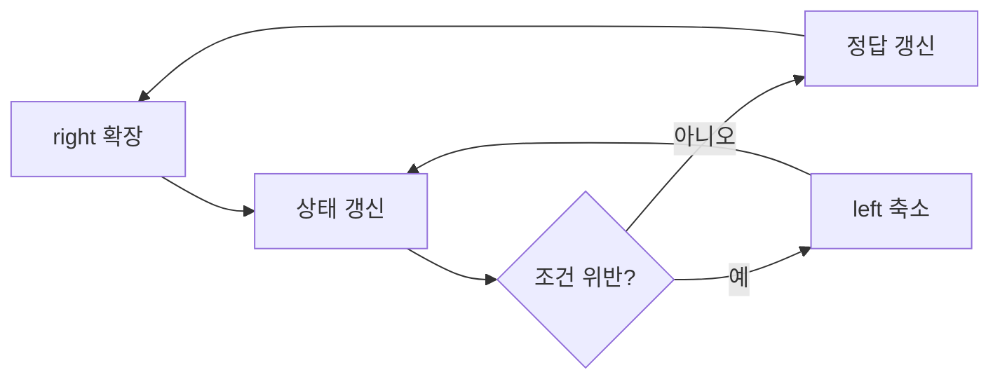

# 투 포인터와 슬라이딩 윈도우

- **투 포인터**는 정렬된 배열이나 연속 구간을 두 인덱스로 탐색해 시간 복잡도를 줄인다.
- **슬라이딩 윈도우**는 `[left, right]` 구간을 유지하며 조건에 따라 양 끝을 이동한다.
- 실무에서는 포인터 이동 조건, 윈도우 상태 갱신, 빈 입력과 경계값 처리가 장애의 주요 원인이다.

## 개념 설명

투 포인터는 보통 `left`, `right`를 배열 양 끝이나 같은 시작점에서 출발시킨다. 두 수의 합, 중복 제거, 정렬 배열 병합처럼 포인터가 한 방향으로만 이동할 수 있을 때 유용하다. 각 원소를 여러 번 되돌아가지 않으므로 전체 시간 복잡도는 대개 `O(N)`이다.

슬라이딩 윈도우는 투 포인터의 대표적인 응용이다. 연속된 구간을 윈도우로 보고 `right`를 확장한 뒤, 조건을 위반하면 `left`를 이동해 구간을 줄인다. 고정 길이 윈도우는 매번 합계 전체를 다시 계산하지 않고 빠지는 값과 들어오는 값을 반영한다. 가변 길이 윈도우는 빈도 맵, 합계, 개수 같은 상태를 함께 관리한다.

핵심은 **윈도우 불변식**이다. 예를 들어 “현재 윈도우에는 중복 문자가 없다”를 항상 유지해야 한다. `right`를 먼저 추가하고 조건이 깨졌을 때 `left`를 제거하는 순서를 지키면 구현이 단순해진다. 음수가 포함된 배열에서 “합이 목표 이하” 같은 조건은 윈도우가 단조롭게 줄어들지 않으므로 일반적인 슬라이딩 윈도우를 적용하면 안 된다. 이 경우 누적 합과 이분 탐색, 덱, 또는 다른 알고리즘을 검토한다.

실무 트러블슈팅에서는 다음을 확인한다. 첫째, `left <= right`와 배열 길이 0 처리 여부다. 둘째, 포인터를 이동하면서 상태를 실제로 제거했는지다. 셋째, 문자열의 “문자” 기준이 바이트인지 유니코드 코드 포인트인지다. 넷째, 합계가 큰 경우 JavaScript의 안전 정수 범위나 정수 오버플로다. 로그에는 매 반복마다 전체 배열을 출력하지 말고 `left`, `right`, 상태 크기, 불변식 위반 시점만 기록하면 재현과 성능을 함께 확보할 수 있다.

```javascript
function longestUnique(s) {
  const seen = new Set();
  let left = 0, best = 0;
  for (let right = 0; right < s.length; right++) {
    while (seen.has(s[right])) {
      seen.delete(s[left++]);
    }
    seen.add(s[right]);
    best = Math.max(best, right - left + 1);
  }
  return best;
}
```



## 면접 질문

### 1. 투 포인터와 이중 반복문의 차이는 무엇인가?

투 포인터는 포인터가 전체 탐색 동안 대체로 한 방향으로만 이동해 `O(N)`을 달성한다. 반면 매 원소마다 처음부터 다시 탐색하면 `O(N²)`이 될 수 있다. 단, 포인터 이동의 근거가 되는 정렬성이나 단조성 조건이 필요하다.

### 2. 슬라이딩 윈도우를 적용할 수 없는 경우는?

윈도우를 줄이거나 늘릴 때 조건이 단조롭게 변하지 않는 경우다. 대표적으로 음수가 포함된 배열에서 부분 배열 합 조건을 다룰 때가 있다. 이때는 누적 합, 해시맵, 이분 탐색 등 문제의 성질에 맞는 방법을 선택한다.

## 한 줄 정리

**포인터를 움직이는 근거와 윈도우 불변식을 먼저 정의하면, 성능과 디버깅 가능성을 함께 얻을 수 있다.**
