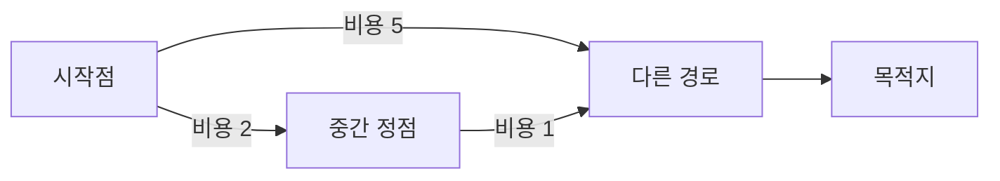

# 최단 경로 알고리즘

- **BFS**: 모든 간선의 비용이 같을 때, 가장 적은 간선 수의 경로를 찾는다.
- **다익스트라**: 간선 가중치가 음수가 아닐 때, 한 시작점에서 모든 정점까지의 최소 비용을 찾는다.
- **벨만–포드와 플로이드–워셜**: 음수 간선을 처리하거나, 모든 정점 쌍의 최단 경로를 구할 때 사용한다.

## 개념 설명

최단 경로 문제는 그래프에서 한 장소에서 다른 장소까지 **가장 적은 비용으로 이동하는 방법**을 찾는 문제다. 그래프의 정점은 도시나 서버, 간선은 도로 또는 네트워크 연결이라고 생각하면 쉽다. 간선의 가중치는 거리, 시간, 요금처럼 이동에 드는 비용이다.

예를 들어 집에서 회사까지 가는 길이 여러 개라면, 단순히 도로 개수가 적은 길이 항상 최선은 아니다. 도로마다 통행료가 다르기 때문이다. 가중치가 없다면 “몇 번 이동했는가”만 세면 되므로 BFS가 적합하다. BFS는 가까운 단계부터 넓게 탐색하기 때문에 처음 도착한 경로가 최단이다.

가중치가 있고 음수가 없다면 다익스트라를 사용한다. 현재까지 비용이 가장 작은 정점을 먼저 확정하고, 그 정점을 거쳐 가는 경로가 더 저렴한지 주변 정점의 비용을 갱신한다. 이를 **완화**라고 한다. 우선순위 큐를 사용하면 효율적으로 구현할 수 있다.

음수 가중치가 존재하면 다익스트라는 이미 확정한 경로가 나중에 더 저렴해질 수 있어 사용할 수 없다. 이때는 벨만–포드를 사용하며, 음수 사이클도 탐지할 수 있다. 모든 정점에서 모든 정점으로 가는 답이 필요하면 플로이드–워셜을 고려한다. 다만 정점 수가 크면 메모리와 시간이 많이 든다.

실무에서는 먼저 조건을 확인한다. **가중치 유무, 음수 간선 유무, 시작점 개수, 그래프 크기**가 알고리즘 선택의 기준이다. 최단 거리뿐 아니라 부모 정점을 저장하면 실제 경로도 복원할 수 있다.

```python
import heapq

def dijkstra(graph, start):
    dist = {v: float("inf") for v in graph}
    dist[start] = 0
    pq = [(0, start)]
    while pq:
        cost, u = heapq.heappop(pq)
        if cost != dist[u]:
            continue
        for v, weight in graph[u]:
            new_cost = cost + weight
            if new_cost < dist[v]:
                dist[v] = new_cost
                heapq.heappush(pq, (new_cost, v))
    return dist
```



## 면접 질문

### 1. 다익스트라를 음수 간선에 사용할 수 없는 이유는?

가장 작은 비용으로 선택한 정점의 거리가 이후에도 최솟값이라고 가정하기 때문이다. 음수 간선이 있으면 나중에 방문한 경로가 기존 비용을 더 줄일 수 있어 이 가정이 깨진다.

### 2. BFS와 다익스트라의 차이는?

BFS는 모든 간선 비용이 동일할 때 간선 개수 기준 최단 경로를 구한다. 다익스트라는 서로 다른 음이 아닌 가중치를 고려해 총 비용 기준 최단 경로를 구한다.

> **한 줄 정리:** 그래프의 가중치 조건과 문제의 범위를 먼저 확인한 뒤 BFS, 다익스트라, 벨만–포드, 플로이드–워셜을 선택한다.
