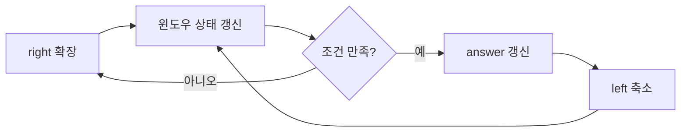

# 투 포인터와 슬라이딩 윈도우

## 핵심 포인트

- **투 포인터**는 배열의 양끝 또는 같은 방향의 두 인덱스를 움직여 탐색 시간을 줄이는 기법이다.
- **슬라이딩 윈도우**는 연속된 구간을 유지하며 `right`로 확장하고 `left`로 축소한다.
- 두 기법 모두 이미 확인한 원소를 반복해서 보지 않아, 많은 경우 `O(N²)` 탐색을 `O(N)`으로 개선한다.

## 개념 설명

투 포인터는 정렬된 배열에서 두 수의 합을 찾거나, 양끝에서 조건을 비교할 때 유용하다. 예를 들어 오름차순 배열에서 목표 합보다 작으면 왼쪽 포인터를 증가시키고, 크면 오른쪽 포인터를 감소시킨다. 포인터가 한 방향으로만 이동하므로 전체 시간 복잡도는 `O(N)`이다.

슬라이딩 윈도우는 투 포인터의 대표적인 응용이다. `[left, right]` 구간을 하나의 윈도우로 보고 `right`를 이동해 원소를 추가한다. 구간의 합, 중복 여부, 조건 위반 여부를 관리하면서 조건이 깨지면 `left`를 이동해 원소를 제거한다. 매번 구간 전체를 다시 계산하지 않고, 추가·삭제되는 값만 반영하는 것이 핵심이다.

예를 들어 양의 정수 배열에서 합이 `target` 이상인 가장 짧은 연속 부분 배열을 찾을 수 있다. 양의 수라는 조건 덕분에 `right`를 늘리면 합은 감소하지 않고, `left`를 줄이면 합은 증가하지 않는다. 따라서 각 인덱스가 최대 두 번만 이동한다.

단, 음수가 포함되면 합의 단조성이 깨질 수 있어 일반적인 윈도우 방식이 동작하지 않는다. 이때는 누적 합과 덱, 이분 탐색 등 다른 기법을 검토해야 한다. 면접에서는 “왜 포인터를 뒤로 이동하지 않아도 되는가?”를 설명하는 것이 중요하다.

```python
def min_len(target, nums):
    left = total = answer = 0
    for right, value in enumerate(nums):
        total += value
        while total >= target:
            length = right - left + 1
            answer = min(answer or length, length)
            total -= nums[left]
            left += 1
    return answer
```



## 면접 질문

### 1. 투 포인터와 슬라이딩 윈도우의 차이는?

투 포인터는 두 인덱스를 활용하는 넓은 개념이고, 슬라이딩 윈도우는 두 포인터로 연속 구간을 유지하며 상태를 갱신하는 패턴이다. 슬라이딩 윈도우는 투 포인터의 한 종류로 볼 수 있다.

### 2. 슬라이딩 윈도우가 항상 `O(N)`인 이유는?

`left`와 `right`가 배열의 시작에서 끝까지 각각 최대 한 번 이동하기 때문이다. 윈도우 내부를 매번 다시 순회하지 않고 합이나 빈도 정보를 증분 갱신하면 전체 시간 복잡도는 `O(N)`이다.

## 한 줄 정리

**연속 구간 조건은 윈도우로 유지하고, 각 포인터를 뒤로 되돌리지 않으면 선형 시간으로 최적화할 수 있다.**
