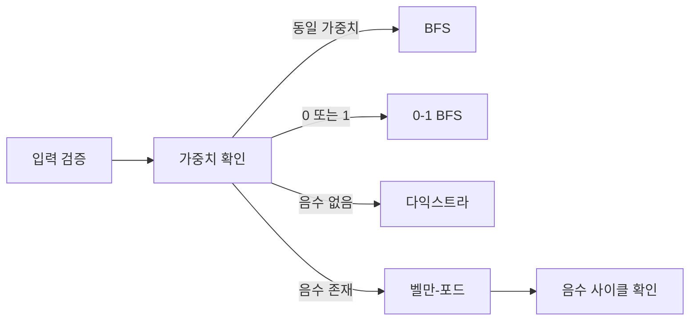

# 최단 경로 알고리즘: 실무 트러블슈팅 중심 정리

- **가중치가 없으면 BFS**, 모든 간선 가중치가 음수가 아니면 **다익스트라**, 음수 간선이 있으면 **벨만-포드**를 우선 검토한다.
- 다익스트라는 우선순위 큐를 사용하며, 일반적인 시간 복잡도는 `O((V+E) log V)`이다.
- 장애의 주요 원인은 알고리즘보다 **음수 가중치, 방향성 누락, 오래된 우선순위 큐 원소, 오버플로, 연결되지 않은 정점**이다.

## 개념 설명

최단 경로 문제는 시작 정점에서 다른 정점까지의 최소 비용을 구하는 문제다. 먼저 비용의 의미를 명확히 해야 한다. 네트워크 지연 시간, 금액, 거리처럼 **합산 가능한 비용**이어야 하며, 비용이 음수인지도 확인해야 한다.

**BFS**는 모든 간선 비용이 동일할 때 최단 간선 수를 보장한다. 가중치가 `0` 또는 `1`뿐이면 0-1 BFS를 사용할 수 있다. **다익스트라**는 현재까지 비용이 가장 작은 정점을 확정하는 그리디 알고리즘이므로 음수 간선이 있으면 오답이 될 수 있다. **벨만-포드**는 음수 간선을 처리하고 음수 사이클도 탐지하지만 `O(VE)`로 느리다. 모든 정점 쌍의 최단 경로가 필요하면 플로이드-워셜을 고려하며 `O(V³)` 비용을 감수해야 한다.

실무에서는 입력 데이터 검증이 핵심이다. 도로가 양방향인지 단방향인지, 비용 단위가 동일한지, 존재하지 않는 경로를 `0`으로 표현하지 않는지 확인한다. 다익스트라 구현에서는 우선순위 큐에 같은 정점이 여러 번 들어갈 수 있으므로, 꺼낸 거리와 최신 거리 배열을 비교해 오래된 항목을 버려야 한다. 큰 비용의 합은 언어의 정수 범위를 초과할 수 있으므로 충분히 큰 자료형을 사용한다. 성능 문제가 발생하면 인접 행렬 대신 인접 리스트, 불필요한 경로 복원 제거, 입력 파싱 최적화를 점검한다.

```python
import heapq

def dijkstra(graph, start):
    INF = 10**18
    dist = [INF] * len(graph)
    dist[start] = 0
    pq = [(0, start)]
    while pq:
        cost, u = heapq.heappop(pq)
        if cost != dist[u]:
            continue
        for v, weight in graph[u]:
            if weight < 0:
                raise ValueError("negative edge")
            new_cost = cost + weight
            if new_cost < dist[v]:
                dist[v] = new_cost
                heapq.heappush(pq, (new_cost, v))
    return dist
```



## 면접 질문

### 1. 다익스트라가 음수 간선을 처리하지 못하는 이유는?

한 번 확정한 정점보다 더 짧은 경로가 이후 음수 간선을 통해 발견될 수 있기 때문이다. 즉, “현재 최소 비용은 최종 최소 비용”이라는 그리디 가정이 깨진다.

### 2. 다익스트라에서 우선순위 큐의 오래된 원소를 왜 무시하나?

거리 갱신 때 기존 원소를 직접 삭제하지 않고 새 원소를 추가하기 때문이다. `cost != dist[u]`를 검사하지 않으면 같은 정점을 불필요하게 반복 처리해 성능이 저하된다.

> **한 줄 정리:** 최단 경로는 그래프의 방향성과 가중치 조건을 먼저 검증한 뒤, 그 조건에 맞는 알고리즘을 선택해야 한다.
