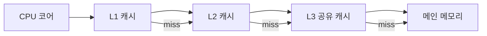

# 캐시 계층(Cache Hierarchy)

- CPU에 가까울수록 캐시는 빠르지만 작고 비싸며, 멀수록 느리지만 크다.
- 캐시 적중률은 **시간 지역성**과 **공간 지역성**에 크게 좌우된다.
- 성능 최적화의 핵심은 데이터 접근 패턴을 캐시 친화적으로 만드는 것이다.

## 개념 설명

CPU는 레지스터 다음으로 보통 L1, L2, L3 캐시와 메인 메모리(RAM)를 차례로 확인한다. L1은 코어별로 존재하며 가장 빠르고 작다. L2도 대체로 코어별이고 L1보다 크지만 느리다. L3는 여러 코어가 공유하며 더 크고 느리다. 캐시에 원하는 데이터가 있으면 **캐시 적중(hit)**, 없으면 **캐시 미스(miss)**다.

캐시는 바이트 하나가 아니라 보통 **캐시 라인(cache line)** 단위로 메모리에서 데이터를 가져온다. 따라서 현재 데이터와 인접한 데이터를 곧 사용할 가능성이 높으면 공간 지역성이 좋다. 같은 변수나 배열 원소를 반복해서 접근하면 시간 지역성이 좋다.

캐시 미스는 크게 세 가지다. 처음 접근하여 발생하는 **콜드 미스**, 캐시 용량이 부족해 발생하는 **용량 미스**, 서로 다른 주소가 같은 캐시 집합에 몰려 발생하는 **충돌 미스**다. 배열을 순차적으로 처리하면 하드웨어 프리페처가 다음 캐시 라인을 미리 가져와 미스를 줄일 수도 있다.

다차원 배열은 일반적으로 행 우선(row-major)으로 저장된다. C/C++에서 `a[i][j]`의 `j`를 안쪽 루프에서 증가시키면 연속 주소를 읽으므로 효율적이다. 반대로 열 단위 접근은 캐시 라인을 충분히 활용하지 못해 느려질 수 있다. 단, 실제 성능은 캐시 크기, 컴파일러 최적화, 메모리 대역폭, 코어 수에 따라 달라진다.

쓰기 정책에는 메모리에도 즉시 반영하는 write-through와 캐시에 먼저 기록한 뒤 나중에 반영하는 write-back이 있다. 멀티코어 환경에서는 캐시 일관성 프로토콜이 필요하며, 서로 다른 스레드가 같은 캐시 라인의 다른 변수를 수정하면 false sharing이 발생할 수 있다.

## 코드 예제: 행 우선 접근

```c
#define N 4096
int a[N][N];

void row_major(void) {
    for (int i = 0; i < N; i++)
        for (int j = 0; j < N; j++)
            a[i][j]++;  // 연속된 메모리 접근
}

void column_major(void) {
    for (int j = 0; j < N; j++)
        for (int i = 0; i < N; i++)
            a[i][j]++;  // 큰 간격의 접근
}
```

`row_major`는 한 캐시 라인을 읽은 뒤 인접 원소를 재사용하므로 대체로 빠르다. `column_major`는 행마다 큰 간격을 이동하여 캐시 미스가 증가한다. 실제 비교는 컴파일러 최적화와 실행 환경의 영향을 받으므로 벤치마크로 확인해야 한다.



## 인터뷰 질문

### 1. 캐시 지역성에는 어떤 종류가 있나요?

시간 지역성은 최근 사용한 데이터를 다시 사용할 가능성이고, 공간 지역성은 현재 접근한 주소 주변을 곧 사용할 가능성이다. 반복문과 연속 배열 접근이 각각 대표적인 활용 사례다.

### 2. 캐시 라인과 false sharing의 관계는 무엇인가요?

캐시는 변수 단위가 아니라 캐시 라인 단위로 일관성을 관리한다. 서로 다른 스레드가 같은 캐시 라인에 있는 독립 변수를 수정하면 라인이 반복 무효화되어 성능이 떨어지는 현상이 false sharing이다.

## 한 줄 정리

**빠른 코드는 연산량뿐 아니라 캐시 라인과 데이터 접근 순서까지 고려한다.**
