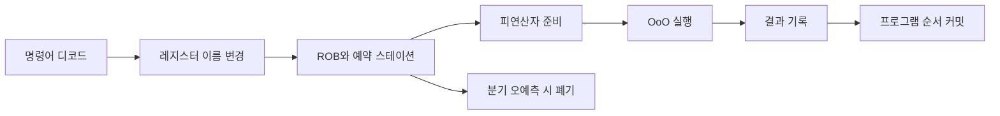

# Out-of-Order Execution: 자주 하는 실수와 안티패턴

- 명령어를 **프로그램 순서와 다르게 실행**하지만, 결과는 가능한 한 프로그램 순서처럼 보이게 만든다.
- 핵심 하드웨어는 **레지스터 이름 변경, 예약 스테이션, ROB(Reorder Buffer)** 이다.
- 성능 향상은 의존성 제거와 대기 시간 은닉에서 나오며, 분기 오예측과 메모리 의존성 실패가 주요 비용이다.

## 개념 설명

In-order 실행은 앞 명령어가 멈추면 뒤의 독립적인 명령어도 기다린다. Out-of-order(OoO) 실행은 명령어를 먼저 디코드·발행한 뒤, 피연산자가 준비된 명령어부터 실행한다. 예를 들어 메모리 로드가 오래 걸리는 동안 덧셈이나 다른 독립 명령어를 실행할 수 있다.

다만 **실행 순서와 완료·커밋 순서는 다르다**. 명령어는 ROB에 기록되고, 실행이 끝나도 프로그램 순서상 앞 명령어가 완료될 때까지 커밋하지 않는다. 이 구조가 예외를 정확한 위치에서 발생시키는 precise exception과 투기 실행 결과의 폐기를 가능하게 한다.

자주 하는 실수는 “OoO면 모든 명령어가 마음대로 실행된다”고 이해하는 것이다. RAW(Read After Write) 의존성은 반드시 지켜야 한다. WAR, WAW 같은 가짜 의존성은 레지스터 이름 변경으로 제거하지만, 실제 데이터 의존성까지 없애지는 못한다.

또 다른 오해는 “명령어 재배치가 곧 메모리 순서 재배치”라는 주장이다. CPU 내부 실행 순서와 다른 코어가 관찰하는 메모리 순서는 메모리 모델, store buffer, fence에 의해 결정된다. 동기화 없는 공유 변수에 의존하는 코드는 OoO 때문이 아니라 데이터 레이스 자체가 잘못된 것이다.

### 자주 하는 안티패턴

- **모든 성능 저하를 OoO 탓으로 돌리기**: 캐시 미스, 분기 오예측, ROB 고갈, 메모리 대역폭도 확인해야 한다.
- **불필요한 직렬 의존성 만들기**: 긴 누적 연산 하나로 여러 작업을 묶으면 OoO가 숨길 병렬성이 줄어든다.
- **volatile만으로 스레드 동기화하기**: volatile은 일반적으로 원자성·상호 배제·충분한 메모리 순서를 보장하지 않는다.
- **fence를 과도하게 사용하기**: 올바른 동기화에는 필요하지만, 남용하면 파이프라인과 메모리 병렬성을 막는다.
- **투기 실행이 부작용을 안전하게 만든다고 생각하기**: 잘못 예측한 경로도 캐시 상태 같은 미세architectural 상태를 바꿀 수 있어 Spectre 계열 취약점이 발생한다.

## 면접 질문

### 1. OoO 실행에서 ROB가 필요한 이유는?

실행 완료 순서와 프로그램 순서가 다를 수 있으므로, 예외를 정확한 명령어에서 처리하고 결과를 프로그램 순서대로 커밋하기 위해 필요하다.

### 2. 레지스터 이름 변경은 어떤 의존성을 제거하는가?

WAR와 WAW 같은 이름 의존성을 제거한다. 하지만 RAW는 실제 값 의존성이므로 제거할 수 없다.

## 한 줄 정리

**OoO는 실행은 준비된 순서대로, 외부에 보이는 결과는 프로그램 순서대로 유지해 명령어 수준 병렬성을 얻는 기법이다.**
