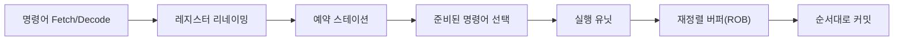

# Out-of-Order Execution(비순차 실행)

- CPU가 명령어를 프로그램 순서와 다르게 실행해 실행 유닛의 유휴 시간을 줄이는 기술이다.
- 데이터 의존성이 해소된 명령어를 먼저 실행하지만, 결과 반영과 예외 처리는 보통 프로그램 순서대로 수행한다.
- 현업에서는 메모리 지연, 분기 실패, 파이프라인 정체를 숨겨 서버·DB·컴파일러 성능을 높이는 데 활용된다.

## 개념 설명

일반적인 순차 실행은 앞선 명령어가 오래 걸리면 뒤의 독립적인 명령어도 대기한다. 비순차 실행 CPU는 명령어를 디코딩한 뒤 **레지스터 리네이밍**, **예약 스테이션**, **재정렬 버퍼(ROB)** 등에 저장한다. 이후 피연산자가 준비된 명령어를 실행 유닛에 먼저 배치한다.

예를 들어 `load`가 메모리를 기다리는 동안, 해당 결과에 의존하지 않는 정수 연산이나 다른 메모리 접근을 실행할 수 있다. 실행 완료 순서는 뒤섞일 수 있지만, ROB를 통해 커밋(retirement)은 프로그램 순서대로 진행한다. 따라서 추측 실행이 실패해도 외부에서 관찰되는 아키텍처 상태를 안전하게 복구할 수 있다.

핵심은 세 가지다. 첫째, 리네이밍으로 가짜 의존성인 WAR·WAW를 제거한다. 둘째, 실제 데이터 의존성인 RAW는 유지한다. 셋째, 분기 예측과 메모리 의존성 예측으로 아직 확정되지 않은 경로도 실행한다. 예측이 틀리면 파이프라인을 비우고 올바른 경로를 다시 실행하므로 성능 손실이 발생한다.

현업에서 성능 분석 시 단순히 클록 주파수만 보지 말고 `IPC`, 분기 실패율, 캐시 미스, 백엔드 실행 포화도를 함께 확인해야 한다. 포인터 추적이 많은 서비스, 랜덤 접근 DB 인덱스, 락 경합 코드는 메모리 지연과 의존성이 커서 OOO 효과가 제한적이다. 반대로 독립적인 요청 처리, 벡터 연산, 여러 캐시 미스가 병렬로 발생하는 코드에서는 효과가 크다. 단, 메모리 순서와 원자 연산은 CPU의 재배치를 제한하므로 락 없는 자료구조에서는 acquire/release 의미를 반드시 이해해야 한다.

## 면접 질문

### 1. 비순차 실행에서도 결과가 올바른 이유는?

실행은 비순차적으로 하더라도 ROB에서 완료 결과를 프로그램 순서대로 커밋하기 때문이다. 예외나 분기 예측 실패가 발생하면 아직 커밋되지 않은 추측 결과를 폐기할 수 있다.

### 2. 레지스터 리네이밍은 어떤 문제를 해결하는가?

서로 다른 명령어가 같은 물리 레지스터를 사용해 생기는 WAR·WAW 가짜 의존성을 제거한다. 실제 값 의존성인 RAW는 제거하지 않는다.

## 한 줄 정리

**Out-of-order execution은 독립적인 작업을 먼저 실행해 지연을 숨기되, 커밋은 순서대로 수행해 정확성을 보장하는 CPU 최적화다.**
