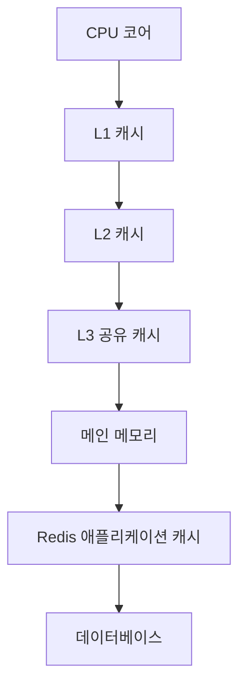

# 캐시 계층(Cache Hierarchy)

- **가까울수록 빠르고 작다:** CPU 레지스터 → L1 → L2 → L3 → 메인 메모리 순으로 지연시간은 증가하고 용량은 커진다.
- **성능의 핵심은 적중률과 지역성:** 시간 지역성·공간 지역성이 높을수록 캐시 적중률이 올라가며, 같은 연산도 데이터 배치에 따라 큰 차이가 난다.
- **현업에서는 계층을 함께 설계한다:** CPU 캐시뿐 아니라 브라우저, CDN, Redis, 애플리케이션 로컬 캐시, DB 버퍼 풀까지 캐시 계층으로 연결된다.

## 개념 설명

캐시는 자주 사용하는 데이터를 느린 저장소보다 빠른 위치에 복사해 두는 장치다. CPU가 메모리를 읽을 때 먼저 L1 데이터 캐시를 확인하고, 실패하면 L2, L3, 메인 메모리 순서로 탐색한다. 이를 **캐시 적중(cache hit)**, 실패를 **캐시 미스(cache miss)**라고 한다. L1은 코어별로 작고 빠르며, L3는 여러 코어가 공유하는 경우가 많다.

캐시 효율은 데이터의 접근 패턴에 크게 좌우된다. **시간 지역성**은 최근 사용한 데이터를 다시 사용할 가능성이고, **공간 지역성**은 인접한 주소를 곧 사용할 가능성이다. 배열을 순차 순회하면 캐시 라인 단위로 데이터를 미리 가져와 효율적이다. 반대로 연결 리스트처럼 메모리 위치가 흩어지면 포인터 추적과 캐시 미스로 느려질 수 있다.

현업에서는 API 응답을 Redis에 저장하고, 애플리케이션 내부에는 짧은 TTL의 로컬 캐시를 둔다. 정적 파일은 CDN에 캐시하며, DB는 버퍼 풀로 디스크 접근을 줄인다. 다만 오래된 데이터(stale data), 캐시 무효화, TTL 설정, 캐시 폭주(cache stampede)를 함께 관리해야 한다. 캐시를 추가한다고 항상 빨라지는 것은 아니다. 갱신 비용과 메모리 사용량, 일관성 요구를 고려해야 한다.

## 코드 예시: 데이터 지역성 비교

```java
int[][] a = new int[4096][4096];
long sum = 0;

// 행 우선 순회: 인접한 메모리를 접근해 캐시 효율이 높음
for (int i = 0; i < a.length; i++)
    for (int j = 0; j < a[i].length; j++)
        sum += a[i][j];

// 열 우선 순회: 큰 간격으로 접근해 캐시 미스가 증가할 수 있음
for (int j = 0; j < a[0].length; j++)
    for (int i = 0; i < a.length; i++)
        sum += a[i][j];
```

## 캐시 계층 흐름



## 인터뷰 질문

1. **캐시 지역성이란 무엇인가요?**  
   최근 사용한 데이터를 재사용하는 시간 지역성과, 인접한 데이터를 함께 사용하는 공간 지역성이다. 배열 순회와 연속 메모리 구조가 일반적으로 유리하다.

2. **캐시 무효화가 어려운 이유는 무엇인가요?**  
   원본 데이터가 변경될 때 여러 캐시의 복사본을 동시에 갱신하거나 제거해야 한다. 분산 환경에서는 TTL, 버전 키, 이벤트 기반 무효화 등을 조합한다.

> **한 줄 정리:** 캐시 계층 성능은 “빠른 저장소를 많이 쓰는 것”보다 데이터 지역성, 적중률, 일관성을 함께 설계하는 데서 나온다.
