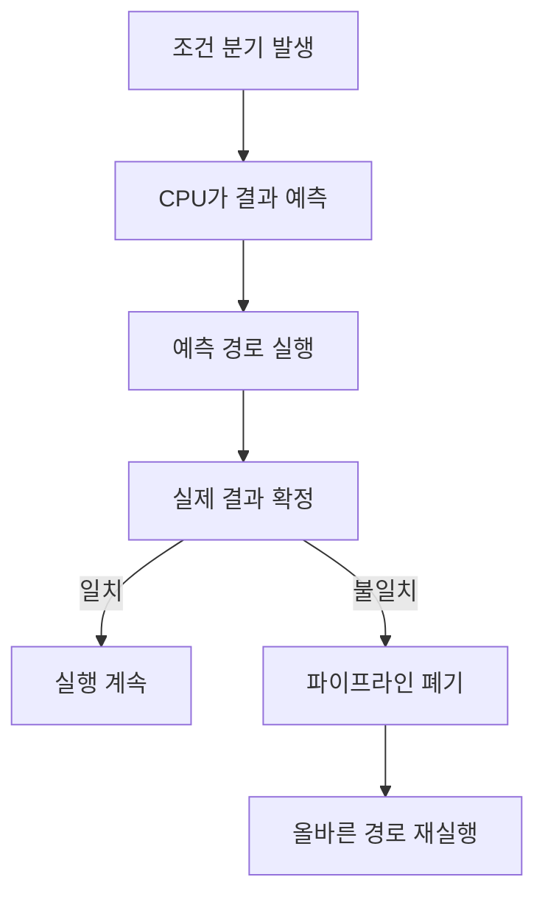

# 브랜치 예측(Branch Prediction)

- CPU는 조건 분기의 결과를 미리 추측해 파이프라인을 멈추지 않게 한다.
- 예측 성공은 성능을 높이지만, 실패하면 잘못 실행한 명령을 폐기하고 파이프라인을 복구한다.
- “분기를 제거하면 항상 빠르다”는 안티패턴이다. 데이터 분포, 컴파일러, CPU, 메모리 비용을 함께 측정해야 한다.

## 개념 설명

조건문이나 반복문에서 CPU는 조건 결과가 확정되기 전에 다음에 실행할 명령어를 선택한다. 이를 브랜치 예측이라 하며, 과거 실행 결과를 저장하는 동적 예측기와 단순 규칙을 사용하는 정적 예측이 있다. 대표적으로 반복문의 뒤로 가는 분기는 대부분 참이라는 패턴을 학습할 수 있다.

예측이 맞으면 실행 흐름이 자연스럽게 이어진다. 틀리면 추측 실행 결과를 버리고 올바른 경로를 다시 채워야 하므로 수~수십 사이클의 손실이 발생할 수 있다. 단, 실제 비용은 CPU 세대와 파이프라인 깊이에 따라 다르다.

자주 하는 실수는 모든 `if`를 성능 문제로 보는 것이다. 예측 가능한 분기는 비용이 작고, 분기 자체보다 캐시 미스·메모리 접근·함수 호출이 더 비쌀 수 있다. 반대로 매번 결과가 무작위인 분기, 데이터 정렬 상태에 따라 결과가 크게 흔들리는 분기는 예측 실패가 많다.

또 다른 안티패턴은 무조건 산술식이나 조건부 이동으로 바꾸는 것이다. 분기 없는 코드는 양쪽 계산을 모두 수행하거나 SIMD 최적화를 방해할 수 있다. 컴파일러가 이미 분기를 `cmov`나 벡터 명령으로 바꿀 수도 있으므로 소스 코드만 보고 판단하지 말고 최적화 빌드와 프로파일러로 확인한다.

실무에서는 자주 참인 경로를 우선 배치하고, 입력을 정렬하거나 버킷화해 결과의 지역성을 높일 수 있다. 그러나 예측률만 최적화하지 말고 전체 실행 시간, 코드 가독성, 보안 요구사항을 함께 평가해야 한다. 분기 예측은 타이밍 차이를 만들 수 있어 암호 키처럼 비밀 데이터에 의존하는 분기는 별도 상수 시간 설계가 필요하다.

## 코드 예시

```cpp
// 무작위 순서: 예측 실패 가능성이 큼
for (int x : data)
    sum += (x > 128) ? x : 0;

// 정렬 후: 같은 조건이 연속되어 예측하기 쉬움
std::sort(data.begin(), data.end());
for (int x : data)
    sum += (x > 128) ? x : 0;
```

## 실행 흐름



## 면접 질문

### 1. 브랜치 미스가 발생하면 왜 느려지는가?

예측 경로를 폐기하고 올바른 명령어를 다시 가져와 파이프라인을 채워야 하기 때문이다. 파이프라인이 깊을수록 손실이 커질 수 있다.

### 2. 분기를 제거하면 항상 성능이 좋아지는가?

아니다. 분기 없는 방식은 불필요한 계산과 레지스터 압박을 늘릴 수 있다. 데이터 분포와 실제 벤치마크 결과를 기준으로 선택해야 한다.

> **한 줄 요약:** 예측 가능한 분기는 두려워하지 말고, 예측 실패가 실제 병목인지 측정한 뒤 최적화하라.
