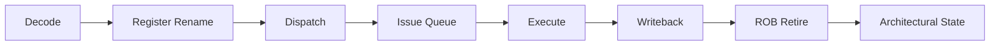

# Out-of-Order Execution

- 명령어를 프로그램 순서와 다르게 실행해 실행 유닛의 유휴 시간을 줄인다.
- 핵심 하드웨어는 레지스터 리네이밍, 예약 스테이션, 재정렬 버퍼다.
- 실행 순서는 뒤섞여도 커밋은 반드시 프로그램 순서를 유지해 정확한 예외를 보장한다.

## 개념 설명

파이프라인이 명령어를 순서대로 실행하면 앞선 명령어가 캐시 미스나 긴 연산으로 멈췄을 때, 서로 의존하지 않는 뒤 명령어까지 기다려야 한다. Out-of-Order Execution은 디코드된 명령어를 내부 대기열에 저장하고, 피연산자가 준비된 명령어부터 실행한다.

먼저 **레지스터 리네이밍**이 WAR, WAW 같은 가짜 의존성을 제거한다. RAT(Register Alias Table)은 아키텍처 레지스터를 물리 레지스터나 아직 완료되지 않은 명령어의 결과에 매핑한다. 새 목적 레지스터마다 새 물리 레지스터를 할당하므로 서로 다른 명령어가 같은 이름을 공유하는 문제를 줄인다.

디스패치된 명령어는 **예약 스테이션** 또는 issue queue에 들어간다. 각 항목은 연산 종류, 소스 피연산자, 준비 여부, 목적지 태그를 가진다. 결과가 생성되면 태그를 브로드캐스트하는 wakeup 과정이 발생하고, 준비된 명령어 중 우선순위가 높은 항목을 select하여 실행 포트로 보낸다. 여러 포트가 있으면 정수 연산, 곱셈, 분기, 로드·스토어를 동시에 처리할 수 있다.

실행 결과는 물리 레지스터 파일에 기록되고 의존 명령어를 깨운다. 그러나 완료 순서는 프로그램 순서와 다를 수 있으므로 **ROB(Reorder Buffer)**가 원래 순서를 기억한다. 명령어는 실행이 끝나도 즉시 외부 상태를 확정하지 않고, ROB의 헤드에 도달했을 때 retire한다. 이때 예외가 없고 분기 예측이 맞으면 아키텍처 상태를 커밋한다. 예외가 발생하면 ROB 이후의 추측 실행 결과를 폐기해 precise exception을 유지한다.

로드·스토어는 메모리 의존성 예측도 사용한다. 뒤의 로드가 앞의 스토어와 다른 주소라고 예측되면 먼저 실행할 수 있지만, 예측이 틀리면 재실행한다. 따라서 성능은 높아지지만 전력, 회로 복잡도, 검증 비용이 증가한다.

## 면접 질문

### 1. Out-of-Order Execution에서 ROB가 필요한 이유는?

실행과 완료 순서가 달라도 커밋을 프로그램 순서로 수행하기 위해 필요하다. 이를 통해 예외 발생 시 아직 커밋되지 않은 후속 명령어를 폐기하고 precise exception을 보장한다.

### 2. 레지스터 리네이밍은 어떤 의존성을 제거하는가?

WAR와 WAW인 이름 의존성을 제거한다. 실제 값이 필요한 RAW 의존성은 제거하지 않으며, 이 의존성은 명령어 실행 순서를 결정한다.

## 한 줄 요약

**명령어는 준비된 순서로 실행하되, 결과의 확정은 프로그램 순서로 수행하는 것이 Out-of-Order Execution이다.**
