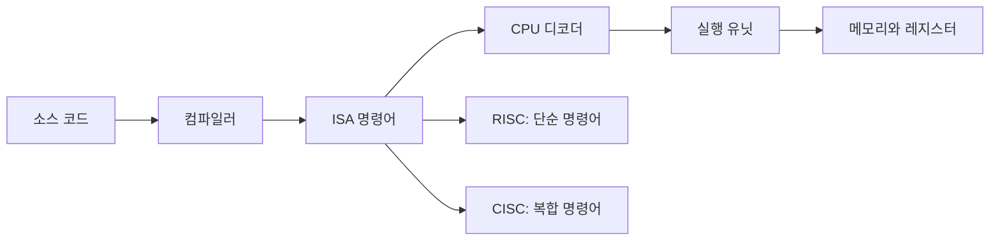

# RISC vs CISC: 명령어 집합 구조 비교

- **RISC**는 단순하고 길이가 일정한 명령어를 사용해 파이프라인과 하드웨어 구현을 단순화한다.
- **CISC**는 복잡하고 다양한 명령어를 제공해 하나의 명령어로 많은 작업을 수행할 수 있다.
- 현대 CPU에서는 구분이 절대적이지 않다. x86은 CISC 명령어를 내부적으로 단순한 마이크로 연산으로 변환하며, ARM도 다양한 확장 명령어를 제공한다.

## 개념 설명

RISC는 **Reduced Instruction Set Computer**의 약자로, 적은 수의 단순한 명령어를 빠르게 실행하는 설계 철학이다. 명령어 길이가 일정한 경우가 많고, 메모리 접근은 `load`와 `store` 명령어로 제한된다. 따라서 디코더, 파이프라인, 분기 예측 같은 CPU 하드웨어를 설계하기 쉽고 전력 효율도 높다. 대표적으로 ARM, RISC-V, MIPS가 있다.

CISC는 **Complex Instruction Set Computer**의 약자다. 메모리에서 값을 읽고 연산한 뒤 저장하는 작업처럼 여러 단계를 하나의 명령어로 표현할 수 있다. 명령어 길이가 가변적이고 주소 지정 방식도 다양해 프로그램 코드 크기를 줄일 수 있지만, 디코딩과 실행 하드웨어가 복잡해진다. 대표적인 예는 x86 계열이다.

과거에는 CISC가 메모리와 컴파일러 기술의 제약을 줄이는 데 유리했고, RISC는 빠른 파이프라이닝에 유리했다. 현재는 두 구조가 서로의 장점을 흡수하고 있다. 예를 들어 현대 x86 CPU는 외부적으로 CISC 명령어를 지원하지만, 내부에서는 이를 여러 개의 단순한 마이크로 연산으로 분해해 실행한다. 따라서 실제 성능은 명령어 개수만이 아니라 캐시, 파이프라인, 실행 유닛, 분기 예측, 컴파일러 최적화에 의해 결정된다.

## 면접 질문

### 1. RISC와 CISC의 핵심 차이는 무엇인가요?

RISC는 단순하고 규칙적인 명령어를 적은 종류로 구성해 파이프라인과 하드웨어를 단순화한다. CISC는 복잡하고 다양한 명령어로 한 명령어가 여러 작업을 수행하도록 설계한다. 다만 현대 CPU에서는 내부 구현이 서로 수렴하고 있다.

### 2. ARM이 x86보다 항상 빠르거나 전력 효율이 좋은가요?

아니다. ARM은 단순한 명령어와 높은 전력 효율을 목표로 하지만, 실제 성능은 공정, 마이크로아키텍처, 캐시, 클럭, 컴파일러와 workload에 따라 달라진다. ARM과 x86의 차이를 ISA만으로 단정하면 안 된다.

## 한 줄 정리

**RISC는 단순한 명령어 실행, CISC는 풍부한 명령어 표현에 초점을 두며, 현대 CPU에서는 내부 구현보다 전체 마이크로아키텍처가 성능을 좌우한다.**
