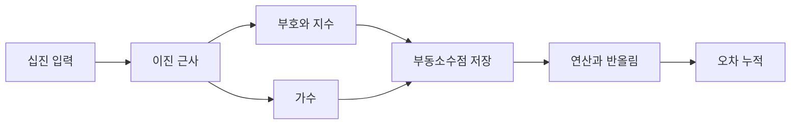

# 부동소수점 표현과 자주 하는 실수

- 실수는 대부분 이진수로 정확히 표현되지 않으므로 `0.1 + 0.2 == 0.3`이 항상 참이라고 가정하면 안 된다.
- IEEE 754는 부호, 지수, 가수로 값을 저장하며, 정밀도와 표현 범위에 한계가 있다.
- 금액 비교에 부동소수점을 직접 사용하지 말고 정수 단위나 decimal 타입을 사용해야 한다.

## 개념 설명

IEEE 754 단정도 `float32`는 32비트를 부호 1비트, 지수 8비트, 가수 23비트로 나눈다. 배정도 `float64`는 각각 1비트, 11비트, 52비트이며, 일반적인 언어의 `double`이 여기에 해당한다.

정규화된 수는 대략 다음 형태로 해석된다.

\[
(-1)^{sign} \times 1.fraction \times 2^{exponent-bias}
\]

지수는 bias를 더해 저장한다. 지수 비트가 모두 0이면 아주 작은 수를 표현하는 비정규수, 모두 1이면 `Infinity` 또는 `NaN`을 나타낸다. 따라서 0으로 나누거나 잘못된 연산의 결과가 정상적인 숫자라고 가정하면 안 된다.

가장 흔한 실수는 십진 소수를 그대로 저장한다고 생각하는 것이다. `0.1`은 이진수로 무한히 반복되므로 유한한 비트로 근사 저장된다. 연산마다 반올림이 발생하고, 큰 수와 작은 수를 더할 때 작은 값이 소실될 수 있다. 또한 `==`로 실수를 비교하거나, 반복문 종료 조건에 실수 누적값을 사용하는 것은 위험한 안티패턴이다.

비교할 때는 허용 오차를 사용한다. 절대 오차만 사용하면 값의 크기가 큰 경우 부적절하고, 상대 오차만 사용하면 0 근처에서 문제가 생긴다. 실무에서는 두 방식을 함께 고려한다. 금융 계산은 가장 작은 화폐 단위로 변환한 정수, 고정소수점, 또는 `Decimal`을 사용한다. 타입 변환으로 정밀도 문제가 자동 해결된다고 생각해서도 안 된다. `float32`로 낮춘 뒤 다시 `float64`로 올려도 잃은 정보는 복구되지 않는다.

```python
import math

x = 0.1 + 0.2
print(x)                         # 0.30000000000000004
print(x == 0.3)                  # False
print(math.isclose(x, 0.3, rel_tol=1e-12))

# 금액은 최소 단위 정수로 계산
price = 1999       # 원
quantity = 3
print(price * quantity)
```



## 면접 질문

### 1. `0.1 + 0.2`가 `0.3`과 같지 않을 수 있는 이유는?

`0.1`과 `0.2`를 이진 부동소수점으로 유한하게 표현할 수 없어 근사값으로 저장하기 때문이다. 연산 결과도 근사값이므로 직접 동등 비교하면 실패할 수 있다.

### 2. 부동소수점 대신 정수를 사용해야 하는 경우는?

돈, 포인트, 재고 수량처럼 정확한 덧셈과 비교가 필요한 경우다. 원 단위나 센트 단위 같은 최소 단위 정수로 저장하면 반올림 오차를 피할 수 있다.

> **한 줄 요약:** 부동소수점은 실수를 저장하는 값이 아니라 근사값이므로, 비교·누적·금액 계산에서 정밀도 한계를 반드시 고려하자.
