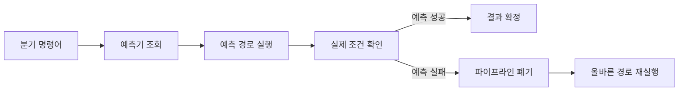

# 브랜치 예측(Branch Prediction)

- **목적:** 조건문·반복문·간접 분기에서 다음에 실행할 명령어 주소를 미리 예측해 파이프라인을 멈추지 않게 한다.
- **핵심 비용:** 예측 성공 시 성능 이득이 크지만, 실패하면 투기 실행 결과를 버리고 파이프라인을 비워야 하므로 여러 사이클의 손실이 발생한다.
- **면접 포인트:** 분기 예측은 컴파일러 최적화가 아니라 주로 CPU 하드웨어가 수행하며, 분기 패턴·히스토리·주소 정보를 이용해 동적으로 학습한다.

## 개념 설명

CPU 파이프라인은 현재 명령어의 조건 비교가 끝나기 전에 다음 명령어를 가져오려 한다. 그러나 `if`, `for`, `while` 같은 분기는 다음 실행 위치가 조건 결과에 따라 달라진다. CPU는 이때 **분기 방향**과 **목적지 주소**를 예측하고 명령어를 투기적으로 실행한다.

가장 단순한 정적 예측은 항상 taken 또는 항상 not-taken으로 가정하는 방식이다. 동적 예측은 과거 실행 결과를 저장해 패턴을 학습한다. 대표적으로 1비트·2비트 포화 카운터를 사용하는 BHT(Branch History Table)가 있으며, 최근 분기 이력을 이용하는 전역 히스토리, 특정 분기 자체의 이력을 이용하는 지역 히스토리도 사용된다. 분기 목적지 주소를 빠르게 찾기 위해 BTB(Branch Target Buffer)를 함께 사용한다.

예측이 맞으면 명령어 인출이 연속적으로 진행된다. 틀리면 잘못 가져온 명령어를 폐기하고 올바른 경로부터 다시 시작한다. 이를 **misprediction penalty**라고 하며, 깊은 파이프라인과 넓은 out-of-order 프로세서일수록 손실이 커질 수 있다. 데이터 패턴이 불규칙하거나 분기 결과가 거의 50:50으로 반복되면 예측 정확도가 낮아진다.

개발자는 예측하기 쉬운 규칙적인 분기, 연속적인 메모리 접근, 불필요한 분기 제거를 고려할 수 있다. 다만 `if`를 무조건 산술식으로 바꾸는 것이 항상 빠른 것은 아니다. 분기 예측 비용과 추가 연산 비용을 실제 프로파일링으로 비교해야 한다. 또한 투기 실행은 Spectre와 같은 보안 취약점의 기반이 될 수 있어, 성능과 보안은 별도로 검토해야 한다.

```c
// 데이터가 정렬되어 있으면 분기 패턴이 예측하기 쉽다.
for (int i = 0; i < n; i++) {
    if (values[i] >= 0)
        sum += values[i];
}

// 무작위 부호라면 예측 실패가 늘 수 있다.
for (int i = 0; i < n; i++) {
    if (random_values[i] >= 0)
        sum += random_values[i];
}
```



## 면접 질문

### 1. 분기 예측 실패가 성능에 미치는 영향은 무엇인가요?

예측된 경로의 명령어를 이미 실행했더라도 결과를 폐기하고 올바른 경로를 다시 인출·실행해야 합니다. 따라서 파이프라인 깊이, 명령어 폭, 메모리 지연 등에 비례하는 사이클 손실이 발생합니다.

### 2. 2비트 분기 예측기가 1비트보다 유리한 이유는 무엇인가요?

2비트 포화 카운터는 강한 예측과 약한 예측 상태를 나눕니다. 따라서 반복문이 종료되는 마지막 한 번의 반전만으로 예측 상태가 즉시 바뀌지 않아, 반복문 경계에서 발생하는 오예측을 줄일 수 있습니다.

> **한 줄 요약:** 브랜치 예측은 CPU가 분기 결과를 미리 추측해 파이프라인을 유지하는 기술이며, 예측 실패 비용이 클수록 규칙적인 실행 패턴이 중요하다.
