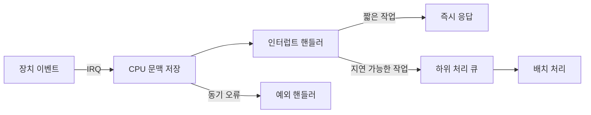

# 인터럽트와 예외: 성능 최적화 관점

- **인터럽트(interrupt)**는 외부 장치나 타이머가 CPU에 비동기적으로 처리를 요청하는 메커니즘이다.
- **예외(exception)**는 현재 실행 중인 명령어와 관련해 동기적으로 발생한다. 예: 페이지 폴트, 0으로 나누기, 시스템 콜.
- 성능의 핵심은 처리 자체보다 **컨텍스트 전환 비용, 캐시 오염, 인터럽트 폭주, 코어 간 불균형**을 줄이는 것이다.

## 개념 설명

CPU는 명령어를 실행하다가 인터럽트 신호를 확인하면 현재 레지스터와 실행 위치를 저장하고, 인터럽트 벡터 테이블(IDT 등)을 통해 핸들러로 이동한다. 핸들러가 종료되면 저장한 문맥을 복원해 원래 작업을 계속한다. 이 과정에서 커널 진입, 레지스터 저장, 분기 예측 실패, 캐시 지역성 저하가 발생한다.

인터럽트는 장치가 준비될 때마다 발생하므로 고속 네트워크에서는 패킷마다 인터럽트가 발생하는 **인터럽트 폭주(interrupt storm)**가 문제가 된다. 이를 줄이기 위해 여러 이벤트를 한 번에 처리하는 배치, 일정 시간 동안 인터럽트를 모으는 인터럽트 병합(interrupt coalescing), NAPI처럼 인터럽트 후 폴링으로 전환하는 기법을 사용한다. 다만 폴링은 유휴 상태에서도 CPU를 사용하므로 부하와 지연 요구를 함께 고려해야 한다.

최적화 시에는 IRQ affinity로 특정 장치의 인터럽트를 적절한 코어에 배치하고, 애플리케이션 스레드와 같은 코어에서 캐시를 재사용할지 또는 분리해 경합을 줄일지 판단한다. 긴 작업은 핸들러에서 직접 수행하지 말고 하위 처리(workqueue, tasklet 등)로 미룬다. 예외의 경우 페이지 폴트처럼 정상 경로에서도 발생할 수 있으므로, 메모리 사전 할당과 페이지 지역성 개선으로 지연을 줄인다. 측정에는 인터럽트 횟수, 핸들러 시간, softirq 시간, p99 지연을 함께 사용한다.

## 처리 흐름



## 코드 예시

```c
#define BATCH 64

void rx_interrupt(void) {
    disable_irq();
    int n = 0;

    while (n < BATCH && packet_ready())
        enqueue_packet(read_packet()), n++;

    enable_irq();
    schedule_rx_worker(); // 무거운 처리는 지연
}
```

핸들러에서 최대 처리량을 제한하고, 실제 파싱이나 복잡한 로직은 별도 작업으로 넘겨 인터럽트 점유 시간을 줄인다.

## 면접 질문

### Q1. 인터럽트와 예외의 차이는?

**답:** 인터럽트는 외부 장치나 타이머에 의해 비동기적으로 발생하고, 예외는 현재 명령어 실행 결과로 동기적으로 발생한다.

### Q2. 인터럽트 폭주를 어떻게 완화하는가?

**답:** 배치 처리, 인터럽트 병합, NAPI 기반 폴링, IRQ affinity 조정, 핸들러의 작업 최소화를 적용하고 지연 시간과 CPU 사용률을 측정한다.

## 한 줄 정리

**인터럽트 최적화는 핸들러를 짧게 만들고, 이벤트를 모아 처리하며, 코어·캐시·지연의 균형을 맞추는 일이다.**
