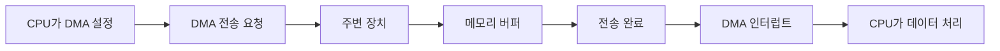

# DMA(Direct Memory Access)

- **DMA는 주변 장치가 CPU 대신 메모리에 직접 데이터를 읽고 쓰는 방식**이다.
- CPU는 전송을 매 바이트 처리하지 않고, **주소·크기·방향을 설정한 뒤 작업을 맡긴다**.
- 전송이 끝나면 DMA가 **인터럽트로 CPU에 완료를 알린다**.

## 개념 설명

DMA는 대량의 데이터를 빠르게 옮기기 위한 하드웨어 기술이다. 예를 들어 디스크에서 큰 파일을 읽는 상황을 생각해 보자. DMA가 없다면 CPU가 디스크에서 데이터를 조금씩 받아 메모리에 직접 복사해야 한다. CPU가 택배 상자 하나마다 직접 운반하는 것과 같다.

DMA를 사용하면 CPU는 운송 담당자에게 “디스크의 이 위치에서 메모리의 이 위치까지, 이 크기만큼 옮겨라”라고 지시한다. 이후 DMA 컨트롤러가 버스(bus)를 사용해 주변 장치와 메모리 사이에서 직접 전송한다. CPU는 그동안 다른 스레드 실행이나 계산을 수행할 수 있다.

일반적인 순서는 다음과 같다.

1. CPU가 DMA의 **소스 주소, 목적지 주소, 전송 크기, 방향**을 설정한다.
2. DMA가 장치와 메모리 사이의 데이터를 직접 이동한다.
3. 전송이 끝나면 DMA가 완료 상태를 기록하고 CPU에 인터럽트를 발생시킨다.
4. CPU는 버퍼를 처리한다.

네트워크 카드, 디스크 컨트롤러, 오디오·비디오 장치에서 특히 유용하다. 다만 CPU 캐시에 오래된 데이터가 남아 있으면 메모리와 캐시의 내용이 달라질 수 있다. 따라서 운영체제와 하드웨어는 캐시 flush/invalidate, DMA 버퍼 규칙, IOMMU 등을 사용해 일관성을 관리한다. DMA 버퍼를 동시에 수정하지 않도록 동기화하는 것도 중요하다.

## 동작 흐름

## 면접 질문

### 1. DMA를 사용하면 CPU 사용량이 항상 0이 되나요?

아니다. CPU는 전송 설정, 버퍼 관리, 완료 인터럽트 처리에 참여한다. 다만 데이터의 반복적인 복사 작업을 DMA가 맡아 CPU 사용량과 개입 횟수를 줄인다.

### 2. DMA 사용 시 캐시 일관성이 왜 문제인가요?

CPU가 캐시에 가진 값과 DMA가 메모리에 기록한 값이 다를 수 있기 때문이다. CPU가 오래된 캐시 값을 읽지 않도록 캐시를 비우거나 무효화하고, 필요하면 DMA 전용 버퍼와 메모리 장벽을 사용한다.

## 한 줄 정리

**DMA는 CPU가 직접 운반하던 대용량 데이터 전송을 전용 하드웨어에 맡겨 성능과 CPU 활용도를 높이는 기술이다.**
