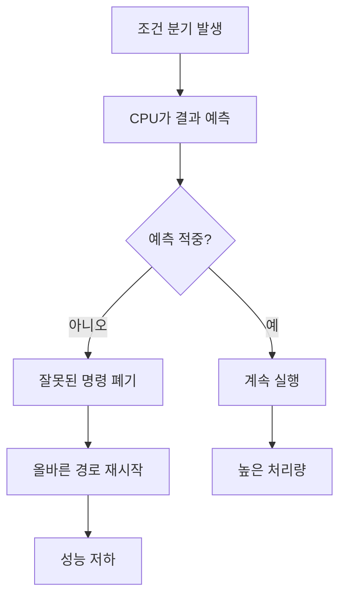

# 브랜치 예측(Branch Prediction)과 성능 최적화

- CPU는 조건 분기의 결과를 미리 추측해 파이프라인을 채우며, 예측이 맞으면 실행 흐름을 유지한다.
- 예측 실패 시 잘못 실행한 명령을 폐기하고 파이프라인을 다시 채워야 하므로 지연이 발생한다.
- 최적화의 핵심은 분기 자체를 무조건 제거하는 것이 아니라, **예측 가능한 분기와 데이터 접근 패턴**을 만드는 것이다.

## 개념 설명

현대 CPU는 한 번에 여러 명령을 파이프라인에서 처리한다. `if`나 반복문의 종료 조건처럼 실행 경로가 갈리는 지점에서는 결과가 확정되기 전에 다음 명령을 추측 실행한다. 일반적으로 최근 실행 결과, 분기 방향, 분기 위치 등을 기록한 하드웨어 예측기가 사용된다.

예측이 적중하면 CPU는 대기 시간을 줄이고 명령어 수준 병렬성을 유지한다. 반대로 실패하면 추측 실행 결과를 폐기하고 올바른 경로를 다시 가져온다. 이때 발생하는 비용은 CPU 세대와 파이프라인 깊이에 따라 다르지만 수~수십 사이클이 될 수 있다. 분기 하나보다 **예측 실패율과 반복 횟수**가 중요하다.

성능 최적화에서는 다음을 고려한다.

1. 정렬된 데이터처럼 결과가 한쪽으로 치우친 분기는 예측이 쉽다.
2. 무작위 조건은 예측이 어려우므로 조건별 데이터를 분리하거나 사전 정렬한다.
3. 작은 루프에서는 분기 없는 산술 연산, 마스크, 조건부 선택을 고려한다. 단, 분기 제거가 항상 빠르지는 않다.
4. 분기 예측보다 캐시 미스 비용이 더 큰 경우도 많으므로 프로파일러와 벤치마크로 검증한다.
5. `likely/unlikely` 힌트는 컴파일러 최적화에 도움을 줄 수 있지만, 잘못 사용하면 코드 배치와 캐시 효율을 악화시킨다.

```cpp
int count_positive(const int* a, int n) {
    int count = 0;
    for (int i = 0; i < n; ++i) {
        if (a[i] > 0) ++count;
    }
    return count;
}

// 무작위 값보다 양수/음수 그룹이 정렬된 입력에서
// 조건 분기의 예측 적중률이 높아질 가능성이 크다.
```



## 인터뷰 질문

### 1. 브랜치 미스가 발생하면 왜 성능이 저하되나요?

추측 실행한 명령을 폐기하고 올바른 명령을 다시 가져와 파이프라인을 채워야 하기 때문이다. 이 동안 실행 자원이 충분히 활용되지 못한다.

### 2. 분기 없는 코드가 항상 더 빠른가요?

아니다. 분기 예측이 잘 되는 코드라면 분기 비용이 작을 수 있고, 분기 없는 연산이 더 많은 명령이나 메모리 접근을 유발할 수 있다. 실제 입력 분포와 하드웨어에서 측정해야 한다.

> **한 줄 요약:** 분기 예측 최적화는 분기를 무조건 제거하는 것이 아니라, 예측 가능성과 데이터·코드 배치를 높여 파이프라인 낭비를 줄이는 작업이다.
