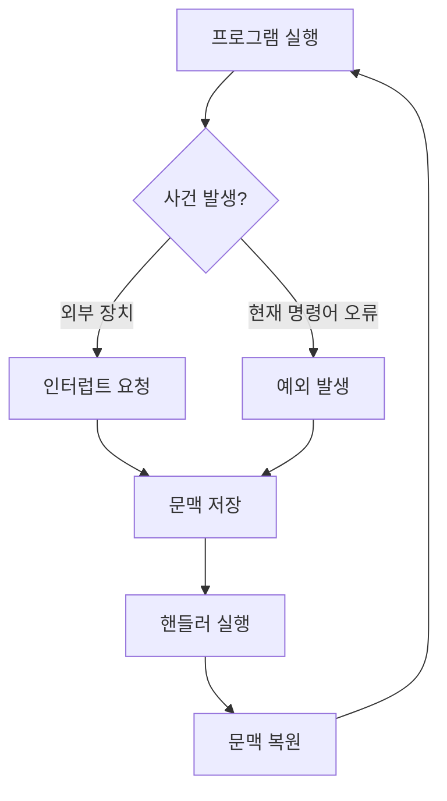

# 인터럽트와 예외

## 핵심 요약

- **인터럽트(Interrupt)**: CPU 외부 장치가 “지금 처리해 주세요”라고 알리는 비동기 사건이다.
- **예외(Exception)**: CPU가 현재 실행 중인 명령어 처리 과정에서 발견한 동기적 사건이다.
- 둘 다 CPU의 흐름을 잠시 멈추고 **핸들러(handler)**를 실행한 뒤, 저장한 위치로 돌아가는 방식으로 처리한다.

## 개념 설명

CPU를 요리사라고 생각해 보자. 요리사는 한 번에 하나의 요리를 만들지만, 초인종이 울리거나 타이머가 끝나면 잠시 작업을 멈추고 손님이나 타이머를 처리해야 한다. 이때 외부에서 울린 초인종이 **인터럽트**다. 키보드 입력, 네트워크 패킷 도착, 디스크 작업 완료, 타이머 만료 등이 예시다. 언제 발생할지 실행 중인 코드가 정확히 예측하기 어렵기 때문에 비동기 사건이라고 한다.

반면 요리 중 칼에 손을 베거나 재료가 부족한 상황처럼, 현재 작업 자체에서 문제가 발견되는 경우가 **예외**다. 0으로 나누기, 잘못된 메모리 접근, 존재하지 않는 명령어 실행 등이 해당한다. 예외는 특정 명령어를 실행하는 순간 발생하므로 동기적이다.

CPU는 사건이 발생하면 현재 프로그램의 **문맥(context)**, 즉 다음에 실행할 주소와 레지스터 상태 등을 저장한다. 이후 인터럽트 벡터 테이블에서 적절한 핸들러 주소를 찾아 실행한다. 처리가 끝나면 문맥을 복원하고 원래 프로그램으로 돌아간다.

예외는 다시 복구 가능한 **fault**, 즉시 보고해야 하는 **trap**, 복구가 어려운 **abort** 등으로 구분하기도 한다. 페이지 폴트는 운영체제가 디스크에서 페이지를 가져온 뒤 명령어를 재실행할 수 있어 대표적인 fault다. 시스템 콜은 프로그램이 운영체제 기능을 요청하는 소프트웨어 인터럽트 또는 trap 방식으로 구현된다.

실무에서는 인터럽트 우선순위, 인터럽트 마스킹, 임계 구역을 고려해야 한다. 핸들러는 빠르게 실행하고, 무거운 작업은 일반 커널 스레드나 작업 큐로 넘기는 것이 좋다. 그렇지 않으면 다른 인터럽트 처리가 지연되고 시스템 응답성이 떨어진다.

```c
void cpu_loop(void) {
    save_context();

    if (external_interrupt_pending())
        handle_interrupt();   // 키보드, 타이머, 네트워크
    else if (exception_detected())
        handle_exception();  // 0으로 나누기, 페이지 폴트
    else
        run_next_instruction();

    restore_context();
}
```



## 면접 질문

### 1. 인터럽트와 예외의 차이는 무엇인가요?

인터럽트는 키보드나 타이머처럼 CPU 외부에서 비동기적으로 발생하고, 예외는 0으로 나누기나 페이지 폴트처럼 현재 명령어 실행 중 동기적으로 발생합니다.

### 2. 인터럽트 핸들러를 짧게 작성해야 하는 이유는 무엇인가요?

핸들러 실행 중에는 다른 작업이나 낮은 우선순위 인터럽트가 지연될 수 있기 때문입니다. 빠르게 원인을 기록하고, 실제 처리는 작업 큐 등으로 넘기는 것이 일반적입니다.

## 한 줄 정리

**인터럽트는 외부 호출벨이고, 예외는 현재 작업 중 발생한 문제이며, CPU는 둘 다 핸들러로 흐름을 전환해 처리한다.**
