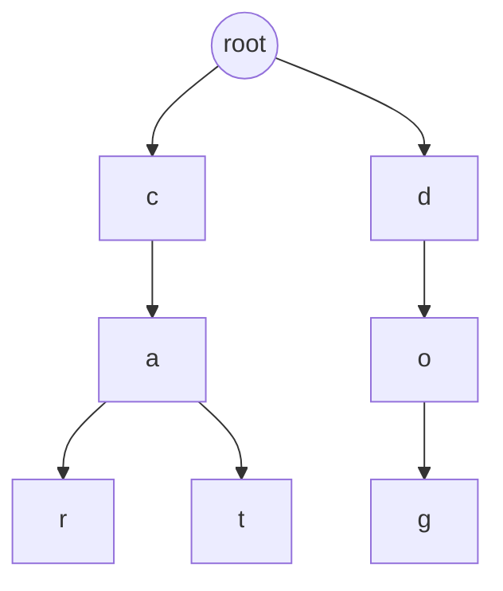

# Trie(트라이): 문자열을 나무처럼 저장하는 자료구조

- **문자 하나씩 따라가는 트리**로, 문자열의 공통 접두사(prefix)를 공유한다.
- 검색·자동완성·사전 기능에 강하며, 문자열 길이를 `L`이라 할 때 검색 시간은 보통 **O(L)**이다.
- 접두사가 겹치면 메모리를 절약할 수 있지만, 문자별 노드가 많아져 **메모리 사용량이 커질 수 있다**.

## 개념 설명

Trie는 여러 문자열을 나무 형태로 저장하는 자료구조다. 초보자에게는 **단어가 적힌 여러 갈래의 길찾기 지도**라고 생각하면 쉽다. 첫 글자에서 출발해 두 번째 글자, 세 번째 글자를 차례로 따라가면 하나의 단어에 도착한다.

예를 들어 `car`, `cat`, `dog`를 저장하면 `car`와 `cat`은 `c → a`까지 같은 길을 공유한다. 이후 `r`과 `t`로 갈라진다. 이처럼 공통 접두사를 한 번만 저장하는 것이 핵심이다.

각 노드는 자식 문자들을 가리키는 자료와 **단어의 끝인지 표시하는 값**을 가진다. `car`를 저장한 뒤 `ca`를 검색하면 `c → a` 경로는 존재하지만, `a` 노드가 단어의 끝으로 표시되어 있지 않으므로 완전히 같은 단어는 아니다. 따라서 “경로가 존재하는가?”와 “단어가 끝났는가?”를 구분해야 한다.

문자열 삽입은 글자를 왼쪽부터 확인하며 없는 노드를 만든다. 검색도 같은 방식으로 이동하므로 문자열 길이가 `L`일 때 시간 복잡도는 `O(L)`이다. 해시 테이블의 평균 `O(1)` 검색과 달리, Trie는 접두사 검색과 사전순 순회가 자연스럽다는 장점이 있다. 반면 영어 알파벳 전체 배열을 모든 노드에 만들면 빈 공간이 많아질 수 있어, 실무에서는 Map이나 압축 Trie를 사용하기도 한다.

자동완성은 입력한 접두사까지 이동한 뒤, 그 노드 아래를 DFS/BFS로 순회해 완성 단어를 수집하는 방식이다. 검색 엔진의 추천어, 금칙어 검사, IP 라우팅의 일부 구현 등에 활용된다.

```javascript
class Trie {
  constructor() { this.root = {}; }
  insert(word) {
    let node = this.root;
    for (const ch of word) node = node[ch] ??= {};
    node.end = true;
  }
  has(word) {
    let node = this.root;
    for (const ch of word) {
      if (!node[ch]) return false;
      node = node[ch];
    }
    return node.end === true;
  }
}
```



## 면접 질문

### 1. Trie의 검색 시간 복잡도는 왜 `O(L)`인가?

문자열의 각 문자를 최대 한 번씩 따라가기 때문이다. 저장된 단어 개수 `N`과 무관하며, `L`은 검색 문자열의 길이다.

### 2. Trie와 Hash Table의 차이는 무엇인가?

Hash Table은 완전한 문자열의 빠른 조회에 유리하고, Trie는 접두사 검색·자동완성·사전순 탐색에 유리하다. Trie는 대신 노드와 연결 정보 때문에 메모리를 더 사용할 수 있다.

## 한 줄 정리

**Trie는 문자열을 글자별 경로로 저장해 접두사 기반 검색을 빠르고 자연스럽게 만드는 트리다.**
