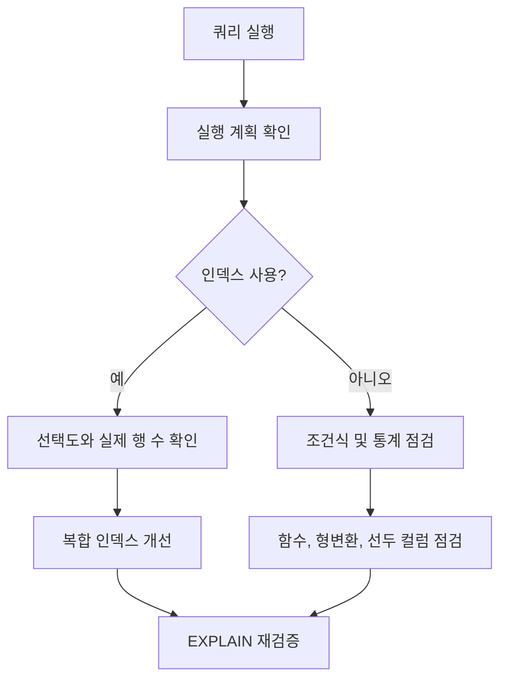

# B-Tree

- **다진 균형 탐색 트리**로, 한 노드에 여러 키와 자식 포인터를 저장해 트리 높이를 낮춘다.
- 데이터베이스 인덱스에서 디스크 I/O를 줄이는 핵심 구조이며, 탐색·삽입·삭제 평균 비용은 `O(log N)`이다.
- 실무에서는 자료구조 자체보다 **인덱스 선택, 카디널리티, 랜덤 I/O, 페이지 분할**을 함께 진단해야 한다.

## 개념 설명

B-Tree의 노드는 하나의 키만 갖는 이진 탐색 트리와 달리 여러 개의 정렬된 키를 가진다. 키 사이의 범위마다 자식 노드가 배치되며, 모든 리프 노드는 같은 깊이에 있다. 한 페이지에 많은 키를 저장할수록 팬아웃(fan-out)이 커지고 트리 높이가 낮아져 디스크 접근 횟수가 감소한다.

관계형 데이터베이스의 일반적인 인덱스는 실제로 **B+Tree**인 경우가 많다. 내부 노드는 탐색용 키만 보유하고, 실제 레코드 위치는 리프에 저장한다. 리프끼리 연결되어 있어 `BETWEEN`, 범위 정렬, 접두사 검색이 효율적이다. 반면 `LIKE '%abc'`, 컬럼에 함수를 적용한 조건, 타입이 다른 비교는 인덱스를 제대로 사용하지 못할 수 있다.

삽입으로 노드가 가득 차면 페이지 분할이 발생한다. 분할은 추가 쓰기와 잠금 경합을 만들며, 순차 증가 키는 대체로 마지막 페이지에 집중되고 랜덤 UUID는 여러 페이지를 분산시켜 페이지 분할과 캐시 미스를 늘릴 수 있다. 다만 순차 키도 특정 리프에 쓰기가 집중되는 핫스팟이 될 수 있다.

### 실무 트러블슈팅 체크리스트

1. `EXPLAIN` 또는 실행 계획으로 인덱스 사용 여부, 예상 행 수와 실제 행 수를 비교한다.
2. 선택도가 낮은 컬럼만 단독 인덱스로 만들지 말고, 실제 조건과 정렬 순서를 반영해 복합 인덱스를 설계한다.
3. 복합 인덱스는 보통 **왼쪽부터 연속된 조건**이 중요하다. 선두 컬럼을 건너뛰면 효율이 떨어진다.
4. 인덱스를 추가하기 전에 테이블 통계 갱신, 오래된 실행 계획, 데이터 분포 변화를 확인한다.
5. 인덱스가 있어도 반환 행이 너무 많으면 랜덤 접근 비용이 커진다. 조회 컬럼을 포함하는 커버링 인덱스와 페이지네이션을 검토한다.
6. 인덱스가 너무 많으면 읽기는 빨라져도 `INSERT`, `UPDATE`, `DELETE`마다 갱신 비용과 저장 공간이 증가한다.

## 코드 예시

```sql
CREATE INDEX idx_orders_user_status_created
ON orders (user_id, status, created_at);

EXPLAIN ANALYZE
SELECT id, created_at
FROM orders
WHERE user_id = 42
  AND status = 'PAID'
ORDER BY created_at DESC
LIMIT 20;
```

## 동작 흐름



## 면접 질문

### 1. B-Tree 인덱스가 해시 인덱스보다 범위 검색에 적합한 이유는?

키가 정렬되어 있고 리프가 순서대로 연결되어 있어 시작 위치를 찾은 뒤 인접 범위를 순차적으로 읽을 수 있기 때문이다. 해시는 동등 비교에는 유리하지만 순서와 범위 정보를 제공하지 않는다.

### 2. 인덱스가 있는데도 풀 테이블 스캔이 발생하는 이유는?

조건의 선택도가 낮거나, 조회 행이 너무 많거나, 컬럼에 함수를 적용했거나, 타입 변환·통계 오류·잘못된 복합 인덱스 순서가 있기 때문이다. 실행 계획과 실제 실행 통계를 함께 확인해야 한다.

> **한 줄 정리:** B-Tree는 트리 높이를 낮춰 I/O를 줄이는 구조이며, 실무 성능은 인덱스 정의보다 데이터 분포와 실행 계획 검증이 좌우한다.
