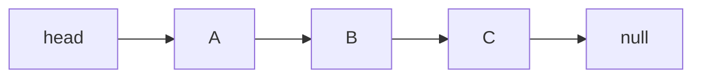

# 연결 리스트(Linked List)

- 데이터와 다음 데이터의 위치를 함께 저장하는 자료구조다.
- 삽입·삭제는 위치를 알고 있다면 빠르지만, 특정 위치 탐색은 느리다.
- 배열과 달리 메모리에 데이터가 연속해서 저장될 필요가 없다.

## 개념 설명

연결 리스트는 **보물찾기 쪽지**와 비슷하다. 각 쪽지에는 보물 자체인 데이터와 “다음 쪽지가 어디 있는지”를 가리키는 주소가 함께 적혀 있다. 첫 쪽지는 `head`가 가리키며, 마지막 쪽지는 다음 주소가 없다는 뜻으로 `null`을 가리킨다.

각 요소를 **노드(Node)**라고 한다. 노드는 보통 `data`와 `next`로 구성된다. `data`는 실제 값이고, `next`는 다음 노드를 참조한다. 따라서 노드들은 메모리상 서로 떨어져 있어도 링크를 따라 순서대로 접근할 수 있다.

배열은 아파트에 번호순으로 붙어 있는 방처럼 연속된 공간을 사용한다. 그래서 인덱스로 바로 접근하는 `arr[3]`이 빠르다. 반면 연결 리스트는 주소가 연결된 단독 주택처럼 흩어져 있어, 세 번째 노드를 찾으려면 첫 노드부터 하나씩 이동해야 한다.

대신 중간에 노드를 삽입하거나 삭제할 때는 주변 링크만 변경하면 된다. 배열처럼 뒤의 모든 데이터를 이동할 필요가 없다. 단, 삽입·삭제할 위치를 찾는 과정까지 포함하면 일반적으로 `O(n)`이 걸린다. 이미 해당 노드를 가리키는 포인터가 있다면 링크 변경은 `O(1)`이다.

대표 종류로는 다음 노드만 가리키는 단일 연결 리스트, 이전 노드도 가리키는 이중 연결 리스트, 마지막 노드가 다시 첫 노드를 가리키는 원형 연결 리스트가 있다. 실무에서는 큐, 해시 테이블의 충돌 처리, 메모리 관리 등에 활용되며, 면접에서는 배열과의 차이와 시간 복잡도를 자주 묻는다.

```python
class Node:
    def __init__(self, data):
        self.data = data
        self.next = None

head = Node("A")
head.next = Node("B")
head.next.next = Node("C")

current = head
while current:
    print(current.data)
    current = current.next
```



## 면접 질문

### 1. 배열과 연결 리스트의 가장 큰 차이는 무엇인가요?

배열은 연속된 메모리를 사용해 인덱스 접근이 `O(1)`이지만, 중간 삽입·삭제는 이동 때문에 `O(n)`이다. 연결 리스트는 임의 위치 접근이 `O(n)`인 대신, 위치를 알고 있으면 링크 변경만으로 삽입·삭제가 `O(1)`이다.

### 2. 연결 리스트에서 `head`가 중요한 이유는 무엇인가요?

`head`는 첫 노드의 위치를 저장하는 시작점이다. 이를 잃으면 나머지 노드로 이동할 방법이 없으므로, 첫 노드를 삭제하거나 리스트를 뒤집을 때 `head`를 올바르게 갱신해야 한다.

## 한 줄 정리

연결 리스트는 **데이터와 다음 위치를 쪽지처럼 연결한 구조**로, 탐색보다 삽입·삭제에 유리하다.
