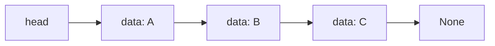

# 연결 리스트(Linked List)

- 노드가 `데이터`와 다음 노드를 가리키는 `링크`로 연결된 선형 자료구조다.
- 배열과 달리 중간 삽입·삭제 시 원소를 직접 이동하지 않아 링크 변경만으로 처리할 수 있다.
- 임의 인덱스 접근은 느리지만, 노드 위치를 알고 있다면 삽입·삭제가 효율적이다.

## 개념 설명

연결 리스트의 기본 단위는 노드(Node)다. 단일 연결 리스트의 노드는 `data`와 `next`를 가지며, `next`는 다음 노드의 주소 또는 참조를 저장한다. 첫 노드는 `head`, 마지막 노드의 `next`는 `None`으로 표현한다.

배열은 메모리상에 원소가 연속적으로 배치되어 인덱스로 빠르게 접근할 수 있다. 반면 연결 리스트는 노드가 메모리 곳곳에 존재해도 링크로 순서를 유지한다. 따라서 `i`번째 원소를 찾으려면 `head`부터 차례대로 이동해야 하므로 접근 시간은 `O(n)`이다.

삽입과 삭제는 위치를 찾았다는 전제에서 `O(1)`에 수행할 수 있다. 예를 들어 `A → B` 사이에 `X`를 삽입하려면 `A.next = X`, `X.next = B`로 연결만 변경한다. 단, 특정 위치를 먼저 탐색해야 한다면 전체 시간은 `O(n)`이 된다.

단일 연결 리스트는 뒤로 이동할 수 없지만 구현이 단순하다. 이중 연결 리스트는 `prev`를 추가해 양방향 순회를 지원하는 대신 노드당 메모리와 링크 관리 비용이 증가한다. 실무에서는 큐, LRU 캐시, 해시 충돌 해결을 위한 체이닝 등에 활용된다.

파이썬에서는 리스트가 동적 배열이므로, 아래 예제는 연결 리스트의 동작을 명확히 보여주기 위해 노드와 리스트를 직접 구현한다. 실제 개발에서는 내장 자료구조와 표준 라이브러리의 성능 특성도 함께 고려해야 한다.

```python
class Node:
    def __init__(self, data):
        self.data, self.next = data, None

class LinkedList:
    def __init__(self):
        self.head = None

    def append(self, data):
        node = Node(data)
        if not self.head:
            self.head = node
            return
        cur = self.head
        while cur.next:
            cur = cur.next
        cur.next = node

    def delete(self, data):
        prev, cur = None, self.head
        while cur and cur.data != data:
            prev, cur = cur, cur.next
        if not cur: return False
        if prev: prev.next = cur.next
        else: self.head = cur.next
        return True
```



## 면접 질문

### 1. 배열과 연결 리스트의 차이는 무엇인가요?

배열은 인덱스 접근이 `O(1)`이고 메모리가 연속적이지만, 중간 삽입·삭제 시 원소 이동이 필요하다. 연결 리스트는 인덱스 접근이 `O(n)`이지만, 노드 위치를 알고 있으면 링크 수정만으로 삽입·삭제가 가능하다. 따라서 캐시 지역성이 중요한 경우 배열이, 구조 변경이 잦은 경우 연결 리스트가 유리할 수 있다.

### 2. 단일 연결 리스트에서 사이클을 어떻게 탐지하나요?

플로이드의 토끼와 거북이 알고리즘을 사용한다. 느린 포인터는 한 칸, 빠른 포인터는 두 칸씩 이동한다. 사이클이 있으면 두 포인터가 언젠가 만나며, 없으면 빠른 포인터가 `None`에 도달한다. 추가 메모리는 `O(1)`, 시간 복잡도는 `O(n)`이다.

> **한 줄 정리:** 연결 리스트는 순차 접근을 감수하고 링크 변경을 통해 유연한 삽입·삭제를 얻는 자료구조다.
