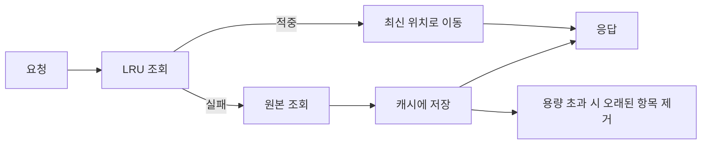

# LRU Cache: 실무 트러블슈팅 중심 정리

- **핵심 원리:** 가장 오래 사용되지 않은 항목(Least Recently Used)을 먼저 제거해 메모리를 제한한다.
- **자료구조:** Hash Map으로 조회를 `O(1)`, 연결 리스트로 사용 순서 변경과 만료 항목 제거를 `O(1)`에 처리한다.
- **운영 포인트:** 캐시 적중률, 메모리 사용량, eviction 횟수, 키별 편중을 함께 관찰해야 한다.

## 개념 설명

LRU 캐시는 제한된 용량 안에서 최근에 사용된 데이터를 우선 보존한다. `get(key)`가 성공하면 해당 항목을 가장 최근 위치로 이동하고, `put(key, value)`로 용량을 초과하면 가장 오래된 항목을 삭제한다. 일반적인 구현은 `Map + 이중 연결 리스트` 조합이다. 리스트의 앞은 최신 항목, 뒤는 가장 오래된 항목을 가리킨다.

실무에서는 단순히 캐시가 빠르다는 이유만으로 적용하면 안 된다. 적중률이 낮으면 원본 DB나 외부 API 부하만 증가하고, 캐시 용량이 부족하면 eviction이 반복되어 오히려 성능이 악화된다. 반대로 TTL 없이 큰 객체를 오래 보관하면 메모리 압박과 GC 지연이 발생할 수 있다. 따라서 최대 엔트리 수뿐 아니라 최대 바이트, TTL, 직렬화 비용도 검토한다.

트러블슈팅 시 먼저 `hit rate = hit / (hit + miss)`를 확인한다. 급격한 miss 증가는 키 포맷 변경, TTL 단축, 배포에 따른 캐시 초기화, 트래픽 패턴 변화의 신호일 수 있다. 특정 키에 요청이 몰리면 캐시 스탬피드가 발생하므로 만료 시 단일 요청만 원본을 조회하는 single-flight, TTL jitter, 사전 갱신을 고려한다. 여러 서버가 공유해야 한다면 로컬 LRU는 서버별로 달라지므로 Redis 같은 분산 캐시가 필요하다. 다만 분산 캐시는 네트워크 지연, 장애 시 fallback, 일관성 정책까지 함께 설계해야 한다.

```js
class LRU {
  constructor(limit) { this.limit = limit; this.map = new Map(); }
  get(key) {
    if (!this.map.has(key)) return undefined;
    const value = this.map.get(key);
    this.map.delete(key); this.map.set(key, value);
    return value;
  }
  set(key, value) {
    if (this.map.has(key)) this.map.delete(key);
    this.map.set(key, value);
    if (this.map.size > this.limit) this.map.delete(this.map.keys().next().value);
  }
}
```



## 면접 질문

1. **LRU를 Hash Map만으로 구현할 수 없는 이유는?**  
   조회는 `O(1)`이어도 사용 순서와 가장 오래된 항목을 효율적으로 관리하기 어렵다. Map과 이중 연결 리스트를 함께 사용하면 조회·갱신·삭제를 모두 `O(1)`에 처리할 수 있다.

2. **캐시 적중률이 낮을 때 무엇을 확인하겠는가?**  
   키 생성 규칙, TTL, 캐시 용량과 eviction, 요청 패턴, 배포 후 초기화 여부를 확인한다. 데이터가 너무 커서 저장되지 않거나 키가 무작위로 생성되는지도 점검한다.

> **한 줄 정리:** LRU는 빠른 저장소가 아니라, 제한된 메모리에서 사용 가치가 높은 데이터를 남기는 정책이며 운영 지표와 함께 설계해야 한다.
