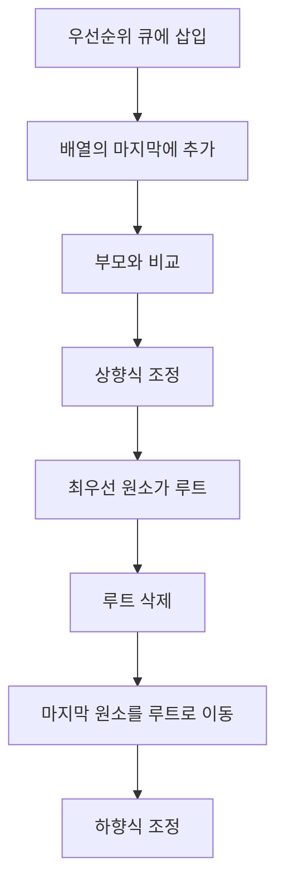

# 힙(Heap)과 우선순위 큐(Priority Queue)

- **힙**은 부모와 자식 노드 사이의 우선순위 조건을 만족하는 완전 이진 트리다.
- **우선순위 큐**는 가장 높은 우선순위의 원소를 먼저 꺼내는 추상 자료형이며, 힙은 이를 구현하는 대표적인 자료구조다.
- 삽입과 최우선 원소 삭제는 `O(log N)`, 최우선 원소 확인은 `O(1)`에 수행할 수 있다.

## 개념 설명

힙은 일반적으로 배열로 구현한다. 완전 이진 트리이므로 노드를 빈 공간 없이 왼쪽부터 채우며, 인덱스를 사용해 부모와 자식 위치를 계산할 수 있다. 0-based 배열에서 부모 인덱스는 `(i - 1) // 2`, 왼쪽 자식은 `2i + 1`, 오른쪽 자식은 `2i + 2`다.

**최소 힙(min-heap)**에서는 부모가 자식보다 작거나 같아 루트에 최솟값이 위치한다. **최대 힙(max-heap)**에서는 부모가 자식보다 크거나 같아 루트에 최댓값이 위치한다. 모든 원소가 정렬된 것은 아니므로 중간 순서나 특정 값의 빠른 검색에는 적합하지 않다.

삽입 시 원소를 마지막 위치에 추가한 뒤 부모와 비교하며 위로 올리는 **상향식 조정(sift-up)**을 수행한다. 삭제 시 루트 제거 후 마지막 원소를 루트로 옮기고, 자식 중 우선순위가 높은 노드와 교환하는 **하향식 조정(sift-down)**을 수행한다. 이 경로의 길이가 트리 높이인 `O(log N)`이다.

우선순위 큐는 작업 스케줄링, 다익스트라 최단 경로, 최소 신장 트리, 이벤트 시뮬레이션 등에 사용된다. Python의 `heapq`는 최소 힙만 지원하므로 최대 힙은 우선순위를 음수로 저장하거나 래퍼 클래스를 사용한다. 우선순위가 같을 때 순서를 보장해야 한다면 `(우선순위, 순번, 데이터)`처럼 순번을 함께 저장한다.

## 코드 예제

```python
import heapq

pq = []
heapq.heappush(pq, (2, "로그 처리"))
heapq.heappush(pq, (1, "긴급 장애 대응"))
heapq.heappush(pq, (3, "통계 생성"))

priority, task = heapq.heappop(pq)
print(task)                    # 긴급 장애 대응
print(pq[0])                   # 다음 최우선 원소 확인

# 최대 힙: 우선순위를 음수로 저장
max_pq = []
for score in [10, 30, 20]:
    heapq.heappush(max_pq, -score)
print(-heapq.heappop(max_pq))  # 30
```



## 면접 질문

### 1. 힙과 이진 탐색 트리의 차이는 무엇인가요?

힙은 루트에서 최솟값 또는 최댓값을 빠르게 얻는 구조이며 전체 정렬이나 임의 값 검색을 보장하지 않는다. 이진 탐색 트리는 왼쪽은 작고 오른쪽은 큰 정렬 규칙을 유지해 탐색에 유리하다.

### 2. 배열 정렬 대신 힙을 사용하는 상황은 언제인가요?

전체 데이터를 한 번 정렬하지 않고도 반복적으로 최솟값이나 최댓값을 꺼내야 할 때 사용한다. 예를 들어 작업이 계속 추가되는 스케줄러나 다익스트라 알고리즘에서는 힙의 `O(log N)` 삽입·삭제가 적합하다.

**한 줄 정리:** 힙은 최우선 원소를 빠르게 관리하고, 우선순위 큐는 힙을 활용해 “가장 중요한 작업부터 처리”하는 자료구조다.
