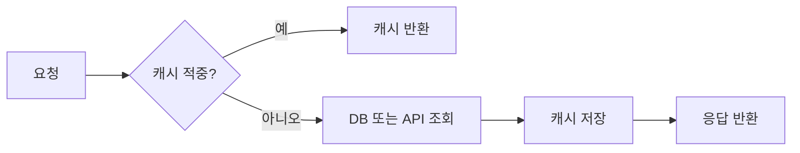

# LRU 캐시

- **LRU(Least Recently Used)**: 캐시가 가득 차면 가장 오래 사용되지 않은 데이터를 제거한다.
- **핵심 자료구조**: 해시맵으로 `O(1)` 조회하고, 이중 연결 리스트로 최근 사용 순서를 `O(1)`에 변경한다.
- **현업 적용**: DB 조회 결과, API 응답, 이미지·파일 메타데이터, 세션 정보 등을 메모리에 임시 저장해 지연 시간과 백엔드 부하를 줄인다.

## 개념 설명

LRU 캐시는 “최근에 사용한 데이터일수록 다시 사용될 가능성이 높다”는 지역성(locality)을 이용한다. `get(key)`가 성공하면 해당 항목을 가장 최근 위치로 이동하고, `put(key, value)`로 새 항목을 저장해도 최근 위치에 둔다. 용량을 초과하면 가장 오래된 항목을 제거한다.

일반적인 구현은 해시맵과 이중 연결 리스트를 함께 사용한다. 해시맵은 키로 노드의 주소를 빠르게 찾고, 리스트는 노드의 순서를 관리한다. 따라서 조회, 삽입, 삭제가 모두 평균 `O(1)`이다. 단순 배열이나 리스트만 사용하면 항목 이동·탐색에 `O(n)`이 필요하다.

현업에서는 애플리케이션 프로세스 내부 캐시뿐 아니라 Redis의 eviction 정책으로도 사용한다. 다만 분산 환경에서 로컬 LRU만 사용하면 서버마다 캐시 상태가 달라질 수 있다. 여러 인스턴스가 공유해야 하는 데이터는 Redis 같은 중앙 캐시를 고려한다. 또한 캐시 만료(TTL), 최대 메모리, 직렬화 비용, 캐시 스탬피드(동시 미스 폭증), 원본 데이터 변경 시 무효화 정책을 함께 설계해야 한다. 캐시 적중률(hit ratio)과 eviction 횟수는 운영 지표로 수집하는 것이 좋다.

```python
from collections import OrderedDict

class LRUCache:
    def __init__(self, capacity):
        self.capacity = capacity
        self.data = OrderedDict()

    def get(self, key):
        if key not in self.data:
            return None
        self.data.move_to_end(key)
        return self.data[key]

    def put(self, key, value):
        self.data[key] = value
        self.data.move_to_end(key)
        if len(self.data) > self.capacity:
            self.data.popitem(last=False)
```



## 면접 질문

### 1. LRU 캐시의 `get`과 `put`을 `O(1)`에 구현하려면?

해시맵과 이중 연결 리스트를 함께 사용한다. 해시맵은 노드를 즉시 찾고, 리스트는 최근 사용 순서를 상수 시간에 갱신한다.

### 2. LRU 캐시와 TTL은 어떤 차이가 있는가?

LRU는 공간 부족 시 제거할 우선순위를 정하고, TTL은 저장 후 일정 시간이 지나면 만료시킨다. 실무에서는 두 정책을 함께 적용하는 경우가 많다.

## 한 줄 요약

**LRU 캐시는 최근 사용 순서를 기준으로 데이터를 제거해, 제한된 메모리에서 높은 캐시 효율을 제공하는 전략이다.**
